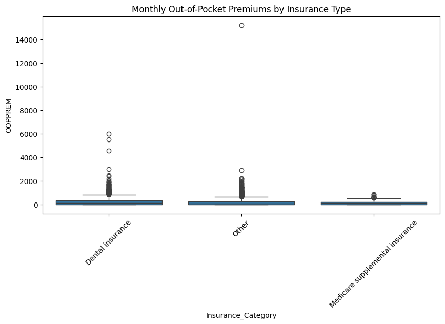
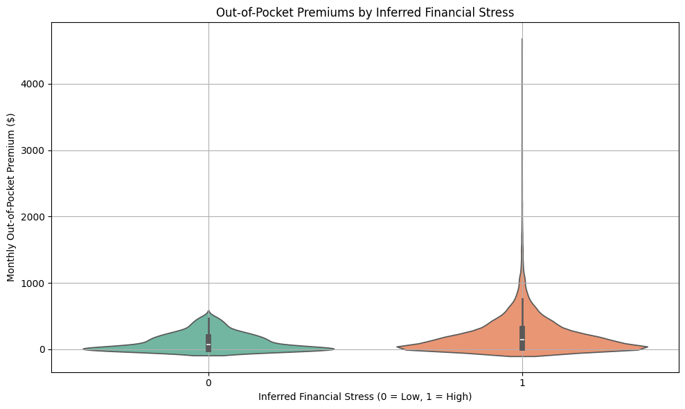

## Final GitHub iO

# **Effects of suprise healthcare expenses** 
## How do out of pocket healthcare expenses, including suprise medical expenses impact financial hardship among individuals in the U.S? 


## Introduction/ Purpose

Healthcare affordability remains a critical social justice issue in the United States, disproportionately affecting low-income and racial minority groups. Surprise medical billing- unexpected out-of-pocket costs for medical services- further exacerbates the financial burden on economically vulnerable populations. Out-of-pocket healthcare costs, including premiums, deductibles, and copayments, can impose severe financial hardships, leading to increased debt, delayed or forgone care, and heightened economic instability. These challenges contribute to persistent health inequities among underserved communities. 

This research examines the relationship between out-of-pocket healthcare costs, including surprise medical expenses, and financial hardship among low-income and racial groups in the United States. Utilizing data from the Medical Expenditure Panel Survey- Household Component (MEPS-HC 242), the study focuses on key variables such as monthly out-of-pocket premiums, insurance coverage type, deductible estimates, and the presence of Medigap and other supplemental insurance. By identifying the extent to which surprise medical billing and other healthcare costs disproportionately affect underserved populations, this study seeks to inform actions aimed at mitigating financial strain and advancing health equity. 

## Methodology 

This analysis utilized data from the Medical Expenditure Panel Survey (MEPS), a nationally representative survey administered by the Agency for Healthcare Research and Quality (AHRQ). MEPS provides detailed information on healthcare utilization, expenditures, insurance coverage, and demographic characteristics for individuals and families in the United States. 

I focused on the most recent full-year consolidated data file to investigate the research question. Key variables included healthcare expenditures, out-of-pocket costs, insurance status, and demographic identifiers such as income level, race/ethnicity, and an individual's geographic region. 

MEPS HC 242
Last Updated August 21, 2024

https://meps.ahrq.gov/data_stats/download_data_files_detail.jsp?cboPufNumber=HC-242


```python
# Install Libraries 

import numpy as np                 #Numerical Python 
import pandas as pd                #Data Analysis
import matplotlib.pyplot as plt    #Plotting
import seaborn as sns              # Statistical Data Visualization 
```


```python
# Read/ Call the dataset 

df = pd.read_excel('h242.xlsx')

# Create the data frame 

h242 = pd.DataFrame(df) ;
```


```python
h242_filtered = h242[h242['PHOLDER'] == 1];

```


```python
h242_filtered1 = h242_filtered[h242_filtered['OOPPREM'] != -1.00];
```


```python
# Drop unnecessary values 

drop_values =[-8]

df = h242_filtered1[~h242_filtered1['OOPPREM'].isin(drop_values)]

print(df);
```

                                       EPCPIDX    DUPERSID    PHLDRIDX  \
    0      24600100106246001010171132460010101  2460010101  2460010101   
    6      24600260101246002610171012460026101  2460026101  2460026101   
    12     24600290101246002910171012460029101  2460029101  2460029101   
    19     24600290102246002910271022460029102  2460029102  2460029102   
    24     24600400103246004010171042460040101  2460040101  2460040101   
    ...                                    ...         ...         ...   
    41590  27996780103279967810211042799678102  2799678102  2799678102   
    41593  27996800103279968010111022799680101  2799680101  2799680101   
    41596  27996820101279968210111012799682101  2799682101  2799682101   
    41608  27996910101279969110111012799691101  2799691101  2799691101   
    41612  27996940103279969410211012799694102  2799694102  2799694102   
    
               ESTBIDX                    EPRSIDX   InsurPrivIDEX  PANEL  RN  \
    0      24600100106  2460010010624600101017113  24600100106113     24   7   
    6      24600260101  2460026010124600261017101  24600260101101     24   7   
    12     24600290101  2460029010124600291017101  24600290101101     24   7   
    19     24600290102  2460029010224600291027102  24600290102102     24   7   
    24     24600400103  2460040010324600401017104  24600400103104     24   7   
    ...            ...                        ...             ...    ...  ..   
    41590  27996780103  2799678010327996781021104  27996780103104     27   1   
    41593  27996800103  2799680010327996801011102  27996800103102     27   1   
    41596  27996820101  2799682010127996821011101  27996820101101     27   1   
    41608  27996910101  2799691010127996911011101  27996910101101     27   1   
    41612  27996940103  2799694010327996941021101  27996940103101     27   1   
    
                  JOBSIDX  JOBSINFR  ...  OOPPREM  OOPPREMX  OOPX12X  OOPFLAG  \
    0      24600101017104         0  ...    357.5     357.5   4290.0        0   
    6      24600261017101         0  ...      0.0       0.0      0.0        0   
    12     24600291017101         0  ...     30.0      30.0    360.0        0   
    19     24600291021102         0  ...    600.0     600.0   7200.0        0   
    24                 -1        -1  ...      0.0       0.0      0.0        0   
    ...               ...       ...  ...      ...       ...      ...      ...   
    41590              -1        -1  ...    375.0     375.0   4500.0        0   
    41593              -1        -1  ...    142.1     142.1   1705.2        0   
    41596              -1        -1  ...    880.0     880.0  10560.0        0   
    41608  27996911011101         0  ...     45.0      45.0    540.0        0   
    41612  27996941021102         0  ...      0.0       0.0      0.0        0   
    
           PREMLEVX  PREMSUBZ  ANNDEDCTP  HSAACCT  UPRHMO_M23  NAMECHNG  
    0             2        -1          3        2           2        -1  
    6             4        -1          5       -1           1         2  
    12            2        -1         -1       -1          -1         2  
    19            2        -1          2       -1           1         2  
    24            4        -1         -1       -1           2         2  
    ...         ...       ...        ...      ...         ...       ...  
    41590         1        -1         -1       -1           2        -1  
    41593         1        -1         -1       -1           2        -1  
    41596         1         2          4        1           2        -1  
    41608         2        -1         -1       -1          -1        -1  
    41612         4        -1          5       -1           2        -1  
    
    [5748 rows x 56 columns]


```python
# Drop unnecessary values 

drop_values = [ -8]

df1 = df[~df['PREMLEVX'].isin(drop_values)]

print(df1);
```

                                       EPCPIDX    DUPERSID    PHLDRIDX  \
    0      24600100106246001010171132460010101  2460010101  2460010101   
    6      24600260101246002610171012460026101  2460026101  2460026101   
    12     24600290101246002910171012460029101  2460029101  2460029101   
    19     24600290102246002910271022460029102  2460029102  2460029102   
    24     24600400103246004010171042460040101  2460040101  2460040101   
    ...                                    ...         ...         ...   
    41590  27996780103279967810211042799678102  2799678102  2799678102   
    41593  27996800103279968010111022799680101  2799680101  2799680101   
    41596  27996820101279968210111012799682101  2799682101  2799682101   
    41608  27996910101279969110111012799691101  2799691101  2799691101   
    41612  27996940103279969410211012799694102  2799694102  2799694102   
    
               ESTBIDX                    EPRSIDX   InsurPrivIDEX  PANEL  RN  \
    0      24600100106  2460010010624600101017113  24600100106113     24   7   
    6      24600260101  2460026010124600261017101  24600260101101     24   7   
    12     24600290101  2460029010124600291017101  24600290101101     24   7   
    19     24600290102  2460029010224600291027102  24600290102102     24   7   
    24     24600400103  2460040010324600401017104  24600400103104     24   7   
    ...            ...                        ...             ...    ...  ..   
    41590  27996780103  2799678010327996781021104  27996780103104     27   1   
    41593  27996800103  2799680010327996801011102  27996800103102     27   1   
    41596  27996820101  2799682010127996821011101  27996820101101     27   1   
    41608  27996910101  2799691010127996911011101  27996910101101     27   1   
    41612  27996940103  2799694010327996941021101  27996940103101     27   1   
    
                  JOBSIDX  JOBSINFR  ...  OOPPREM  OOPPREMX  OOPX12X  OOPFLAG  \
    0      24600101017104         0  ...    357.5     357.5   4290.0        0   
    6      24600261017101         0  ...      0.0       0.0      0.0        0   
    12     24600291017101         0  ...     30.0      30.0    360.0        0   
    19     24600291021102         0  ...    600.0     600.0   7200.0        0   
    24                 -1        -1  ...      0.0       0.0      0.0        0   
    ...               ...       ...  ...      ...       ...      ...      ...   
    41590              -1        -1  ...    375.0     375.0   4500.0        0   
    41593              -1        -1  ...    142.1     142.1   1705.2        0   
    41596              -1        -1  ...    880.0     880.0  10560.0        0   
    41608  27996911011101         0  ...     45.0      45.0    540.0        0   
    41612  27996941021102         0  ...      0.0       0.0      0.0        0   
    
           PREMLEVX  PREMSUBZ  ANNDEDCTP  HSAACCT  UPRHMO_M23  NAMECHNG  
    0             2        -1          3        2           2        -1  
    6             4        -1          5       -1           1         2  
    12            2        -1         -1       -1          -1         2  
    19            2        -1          2       -1           1         2  
    24            4        -1         -1       -1           2         2  
    ...         ...       ...        ...      ...         ...       ...  
    41590         1        -1         -1       -1           2        -1  
    41593         1        -1         -1       -1           2        -1  
    41596         1         2          4        1           2        -1  
    41608         2        -1         -1       -1          -1        -1  
    41612         4        -1          5       -1           2        -1  
    
    [5748 rows x 56 columns]


```python
# Drop unnecessary values 

drop_values = [ -8]

df2 = df1[~df1['EMPLSTAT'].isin(drop_values)]

print(df2)

```

                                       EPCPIDX    DUPERSID    PHLDRIDX  \
    0      24600100106246001010171132460010101  2460010101  2460010101   
    6      24600260101246002610171012460026101  2460026101  2460026101   
    12     24600290101246002910171012460029101  2460029101  2460029101   
    19     24600290102246002910271022460029102  2460029102  2460029102   
    24     24600400103246004010171042460040101  2460040101  2460040101   
    ...                                    ...         ...         ...   
    41590  27996780103279967810211042799678102  2799678102  2799678102   
    41593  27996800103279968010111022799680101  2799680101  2799680101   
    41596  27996820101279968210111012799682101  2799682101  2799682101   
    41608  27996910101279969110111012799691101  2799691101  2799691101   
    41612  27996940103279969410211012799694102  2799694102  2799694102   
    
               ESTBIDX                    EPRSIDX   InsurPrivIDEX  PANEL  RN  \
    0      24600100106  2460010010624600101017113  24600100106113     24   7   
    6      24600260101  2460026010124600261017101  24600260101101     24   7   
    12     24600290101  2460029010124600291017101  24600290101101     24   7   
    19     24600290102  2460029010224600291027102  24600290102102     24   7   
    24     24600400103  2460040010324600401017104  24600400103104     24   7   
    ...            ...                        ...             ...    ...  ..   
    41590  27996780103  2799678010327996781021104  27996780103104     27   1   
    41593  27996800103  2799680010327996801011102  27996800103102     27   1   
    41596  27996820101  2799682010127996821011101  27996820101101     27   1   
    41608  27996910101  2799691010127996911011101  27996910101101     27   1   
    41612  27996940103  2799694010327996941021101  27996940103101     27   1   
    
                  JOBSIDX  JOBSINFR  ...  OOPPREM  OOPPREMX  OOPX12X  OOPFLAG  \
    0      24600101017104         0  ...    357.5     357.5   4290.0        0   
    6      24600261017101         0  ...      0.0       0.0      0.0        0   
    12     24600291017101         0  ...     30.0      30.0    360.0        0   
    19     24600291021102         0  ...    600.0     600.0   7200.0        0   
    24                 -1        -1  ...      0.0       0.0      0.0        0   
    ...               ...       ...  ...      ...       ...      ...      ...   
    41590              -1        -1  ...    375.0     375.0   4500.0        0   
    41593              -1        -1  ...    142.1     142.1   1705.2        0   
    41596              -1        -1  ...    880.0     880.0  10560.0        0   
    41608  27996911011101         0  ...     45.0      45.0    540.0        0   
    41612  27996941021102         0  ...      0.0       0.0      0.0        0   
    
           PREMLEVX  PREMSUBZ  ANNDEDCTP  HSAACCT  UPRHMO_M23  NAMECHNG  
    0             2        -1          3        2           2        -1  
    6             4        -1          5       -1           1         2  
    12            2        -1         -1       -1          -1         2  
    19            2        -1          2       -1           1         2  
    24            4        -1         -1       -1           2         2  
    ...         ...       ...        ...      ...         ...       ...  
    41590         1        -1         -1       -1           2        -1  
    41593         1        -1         -1       -1           2        -1  
    41596         1         2          4        1           2        -1  
    41608         2        -1         -1       -1          -1        -1  
    41612         4        -1          5       -1           2        -1  
    
    [5748 rows x 56 columns]


```python
# Drop unnecessary values 

drop_values = [-8]

df3 = df2[~df2['COBRA'].isin(drop_values)]

print(df3);

```

                                       EPCPIDX    DUPERSID    PHLDRIDX  \
    0      24600100106246001010171132460010101  2460010101  2460010101   
    6      24600260101246002610171012460026101  2460026101  2460026101   
    12     24600290101246002910171012460029101  2460029101  2460029101   
    19     24600290102246002910271022460029102  2460029102  2460029102   
    24     24600400103246004010171042460040101  2460040101  2460040101   
    ...                                    ...         ...         ...   
    41590  27996780103279967810211042799678102  2799678102  2799678102   
    41593  27996800103279968010111022799680101  2799680101  2799680101   
    41596  27996820101279968210111012799682101  2799682101  2799682101   
    41608  27996910101279969110111012799691101  2799691101  2799691101   
    41612  27996940103279969410211012799694102  2799694102  2799694102   
    
               ESTBIDX                    EPRSIDX   InsurPrivIDEX  PANEL  RN  \
    0      24600100106  2460010010624600101017113  24600100106113     24   7   
    6      24600260101  2460026010124600261017101  24600260101101     24   7   
    12     24600290101  2460029010124600291017101  24600290101101     24   7   
    19     24600290102  2460029010224600291027102  24600290102102     24   7   
    24     24600400103  2460040010324600401017104  24600400103104     24   7   
    ...            ...                        ...             ...    ...  ..   
    41590  27996780103  2799678010327996781021104  27996780103104     27   1   
    41593  27996800103  2799680010327996801011102  27996800103102     27   1   
    41596  27996820101  2799682010127996821011101  27996820101101     27   1   
    41608  27996910101  2799691010127996911011101  27996910101101     27   1   
    41612  27996940103  2799694010327996941021101  27996940103101     27   1   
    
                  JOBSIDX  JOBSINFR  ...  OOPPREM  OOPPREMX  OOPX12X  OOPFLAG  \
    0      24600101017104         0  ...    357.5     357.5   4290.0        0   
    6      24600261017101         0  ...      0.0       0.0      0.0        0   
    12     24600291017101         0  ...     30.0      30.0    360.0        0   
    19     24600291021102         0  ...    600.0     600.0   7200.0        0   
    24                 -1        -1  ...      0.0       0.0      0.0        0   
    ...               ...       ...  ...      ...       ...      ...      ...   
    41590              -1        -1  ...    375.0     375.0   4500.0        0   
    41593              -1        -1  ...    142.1     142.1   1705.2        0   
    41596              -1        -1  ...    880.0     880.0  10560.0        0   
    41608  27996911011101         0  ...     45.0      45.0    540.0        0   
    41612  27996941021102         0  ...      0.0       0.0      0.0        0   
    
           PREMLEVX  PREMSUBZ  ANNDEDCTP  HSAACCT  UPRHMO_M23  NAMECHNG  
    0             2        -1          3        2           2        -1  
    6             4        -1          5       -1           1         2  
    12            2        -1         -1       -1          -1         2  
    19            2        -1          2       -1           1         2  
    24            4        -1         -1       -1           2         2  
    ...         ...       ...        ...      ...         ...       ...  
    41590         1        -1         -1       -1           2        -1  
    41593         1        -1         -1       -1           2        -1  
    41596         1         2          4        1           2        -1  
    41608         2        -1         -1       -1          -1        -1  
    41612         4        -1          5       -1           2        -1  
    
    [5739 rows x 56 columns]


```python
df3 = df3.loc[:,['DUPERSID','HSAACCT', 'PREMSUBZ', 'PREMLEVX', 'OOPPREM','COBRA','PMEDINS', 'EMPLSTAT','PrivateCat_M23','MSUPINSX', 'DENTLINS']]
```


```python
mepsdatacolumns = df3.columns

mepsdatacolumns
```


    Index(['DUPERSID', 'HSAACCT', 'PREMSUBZ', 'PREMLEVX', 'OOPPREM', 'COBRA',
           'PMEDINS', 'EMPLSTAT', 'PrivateCat_M23', 'MSUPINSX', 'DENTLINS'],
          dtype='object')


```python
# Assign average 

value_counts = df3['PREMSUBZ'].value_counts()

print("\nValue counts:\n", value_counts);
```

    
    Value counts:
     PREMSUBZ
    -1    5250
     1     286
     2     176
    -8      25
    -7       2
    Name: count, dtype: int64


```python
value_counts = df3['HSAACCT'].value_counts()

print("\nValue counts:\n", value_counts)
```

    
    Value counts:
     HSAACCT
    -1    3867
     2    1063
     1     776
    -8      32
    -7       1
    Name: count, dtype: int64


```python
value_counts = df3['OOPPREM'].value_counts()

print("\nValue counts:\n", value_counts);
```

    
    Value counts:
     OOPPREM
     0.00       1274
     200.00      126
     300.00       96
    -15.00        91
     400.00       87
                ... 
     130.11        1
     142.88        1
     157.46        1
     1003.17       1
     142.10        1
    Name: count, Length: 1056, dtype: int64


```python
# Insurance Type Mapping 

# Define  categorical mapping

df3['Insurance_Category'] = np.where(
    df3['PrivateCat_M23'].isin([1, 2, 3, 4, 5, 6, 99]) & (df3['MSUPINSX'] == 1), 
    'Medicare supplemental insurance', 
    np.where(
        df3['PrivateCat_M23'].isin([1, 2, 3, 4, 5, 6, 99]) & (df3['MSUPINSX'] != 1) & (df3['DENTLINS'] == 1),
        'Dental insurance',
        'Other'
    )
)

print(df3)
```

             DUPERSID  HSAACCT  PREMSUBZ  PREMLEVX  OOPPREM  COBRA  PMEDINS  \
    0      2460010101        2        -1         2    357.5     -1        2   
    6      2460026101       -1        -1         4      0.0     -1        1   
    12     2460029101       -1        -1         2     30.0     -1        2   
    19     2460029102       -1        -1         2    600.0    -15        1   
    24     2460040101       -1        -1         4      0.0     -1        2   
    ...           ...      ...       ...       ...      ...    ...      ...   
    41590  2799678102       -1        -1         1    375.0     -1        2   
    41593  2799680101       -1        -1         1    142.1     -1        2   
    41596  2799682101        1         2         1    880.0     -1        1   
    41608  2799691101       -1        -1         2     45.0    -15        2   
    41612  2799694102       -1        -1         4      0.0    -15        1   
    
           EMPLSTAT  PrivateCat_M23  MSUPINSX  DENTLINS  \
    0            -1               1         2         1   
    6            -1               1         2         1   
    12           -1               0         2         1   
    19           -1               1         2         2   
    24           -1              99         1         2   
    ...         ...             ...       ...       ...   
    41590        -1               2         1         2   
    41593        -1               2         1         2   
    41596        -1              99         2         2   
    41608        -1               0         2         1   
    41612        -1               1         2         1   
    
                        Insurance_Category  
    0                     Dental insurance  
    6                     Dental insurance  
    12                               Other  
    19                               Other  
    24     Medicare supplemental insurance  
    ...                                ...  
    41590  Medicare supplemental insurance  
    41593  Medicare supplemental insurance  
    41596                            Other  
    41608                            Other  
    41612                 Dental insurance  
    
    [5739 rows x 12 columns]


```python
# Define valid responses (employment status)
valid_values = [1, 2, 3, 4, 91]

# Compute the most frequent valid response (mode)
mode_value = df3[df3['EMPLSTAT'].isin(valid_values)]['EMPLSTAT'].mode()[0]

# Reassign non-informative responses (-15, -8, -7, -1) to the mode
df3['EMPLSTAT '] = df3['EMPLSTAT'].replace([-15, -8, -7, -1], mode_value)

print(df3)
```

             DUPERSID  HSAACCT  PREMSUBZ  PREMLEVX  OOPPREM  COBRA  PMEDINS  \
    0      2460010101        2        -1         2    357.5     -1        2   
    6      2460026101       -1        -1         4      0.0     -1        1   
    12     2460029101       -1        -1         2     30.0     -1        2   
    19     2460029102       -1        -1         2    600.0    -15        1   
    24     2460040101       -1        -1         4      0.0     -1        2   
    ...           ...      ...       ...       ...      ...    ...      ...   
    41590  2799678102       -1        -1         1    375.0     -1        2   
    41593  2799680101       -1        -1         1    142.1     -1        2   
    41596  2799682101        1         2         1    880.0     -1        1   
    41608  2799691101       -1        -1         2     45.0    -15        2   
    41612  2799694102       -1        -1         4      0.0    -15        1   
    
           EMPLSTAT  PrivateCat_M23  MSUPINSX  DENTLINS  \
    0            -1               1         2         1   
    6            -1               1         2         1   
    12           -1               0         2         1   
    19           -1               1         2         2   
    24           -1              99         1         2   
    ...         ...             ...       ...       ...   
    41590        -1               2         1         2   
    41593        -1               2         1         2   
    41596        -1              99         2         2   
    41608        -1               0         2         1   
    41612        -1               1         2         1   
    
                        Insurance_Category  EMPLSTAT   
    0                     Dental insurance          2  
    6                     Dental insurance          2  
    12                               Other          2  
    19                               Other          2  
    24     Medicare supplemental insurance          2  
    ...                                ...        ...  
    41590  Medicare supplemental insurance          2  
    41593  Medicare supplemental insurance          2  
    41596                            Other          2  
    41608                            Other          2  
    41612                 Dental insurance          2  
    
    [5739 rows x 13 columns]


```python
df3.isnull().sum()
```


    DUPERSID              0
    HSAACCT               0
    PREMSUBZ              0
    PREMLEVX              0
    OOPPREM               0
    COBRA                 0
    PMEDINS               0
    EMPLSTAT              0
    PrivateCat_M23        0
    MSUPINSX              0
    DENTLINS              0
    Insurance_Category    0
    EMPLSTAT              0
    dtype: int64


```python
df3.describe()
```


<div>
<style scoped>
    .dataframe tbody tr th:only-of-type {
        vertical-align: middle;
    }

    .dataframe tbody tr th {
        vertical-align: top;
    }

    .dataframe thead th {
        text-align: right;
    }
</style>
<table border="1" class="dataframe">
  <thead>
    <tr style="text-align: right;">
      <th></th>
      <th>DUPERSID</th>
      <th>HSAACCT</th>
      <th>PREMSUBZ</th>
      <th>PREMLEVX</th>
      <th>OOPPREM</th>
      <th>COBRA</th>
      <th>PMEDINS</th>
      <th>EMPLSTAT</th>
      <th>PrivateCat_M23</th>
      <th>MSUPINSX</th>
      <th>DENTLINS</th>
      <th>EMPLSTAT</th>
    </tr>
  </thead>
  <tbody>
    <tr>
      <th>count</th>
      <td>5.739000e+03</td>
      <td>5739.000000</td>
      <td>5739.000000</td>
      <td>5739.000000</td>
      <td>5739.000000</td>
      <td>5739.000000</td>
      <td>5739.000000</td>
      <td>5739.000000</td>
      <td>5739.000000</td>
      <td>5739.000000</td>
      <td>5739.000000</td>
      <td>5739.000000</td>
    </tr>
    <tr>
      <th>mean</th>
      <td>2.676307e+09</td>
      <td>-0.213975</td>
      <td>-0.840913</td>
      <td>1.906778</td>
      <td>218.896731</td>
      <td>-2.193936</td>
      <td>0.993204</td>
      <td>-0.604286</td>
      <td>3.278446</td>
      <td>1.714584</td>
      <td>1.163443</td>
      <td>2.330197</td>
    </tr>
    <tr>
      <th>std</th>
      <td>1.302894e+08</td>
      <td>1.367427</td>
      <td>0.822284</td>
      <td>2.519603</td>
      <td>358.207381</td>
      <td>4.283097</td>
      <td>1.285543</td>
      <td>5.597769</td>
      <td>12.959001</td>
      <td>1.431270</td>
      <td>1.340230</td>
      <td>5.376311</td>
    </tr>
    <tr>
      <th>min</th>
      <td>2.460010e+09</td>
      <td>-8.000000</td>
      <td>-8.000000</td>
      <td>-15.000000</td>
      <td>-15.000000</td>
      <td>-15.000000</td>
      <td>-8.000000</td>
      <td>-15.000000</td>
      <td>0.000000</td>
      <td>-8.000000</td>
      <td>-8.000000</td>
      <td>1.000000</td>
    </tr>
    <tr>
      <th>25%</th>
      <td>2.680073e+09</td>
      <td>-1.000000</td>
      <td>-1.000000</td>
      <td>2.000000</td>
      <td>0.000000</td>
      <td>-1.000000</td>
      <td>1.000000</td>
      <td>-1.000000</td>
      <td>1.000000</td>
      <td>2.000000</td>
      <td>1.000000</td>
      <td>2.000000</td>
    </tr>
    <tr>
      <th>50%</th>
      <td>2.687279e+09</td>
      <td>-1.000000</td>
      <td>-1.000000</td>
      <td>2.000000</td>
      <td>132.170000</td>
      <td>-1.000000</td>
      <td>1.000000</td>
      <td>-1.000000</td>
      <td>1.000000</td>
      <td>2.000000</td>
      <td>1.000000</td>
      <td>2.000000</td>
    </tr>
    <tr>
      <th>75%</th>
      <td>2.794082e+09</td>
      <td>1.000000</td>
      <td>-1.000000</td>
      <td>2.000000</td>
      <td>300.000000</td>
      <td>-1.000000</td>
      <td>1.000000</td>
      <td>-1.000000</td>
      <td>1.000000</td>
      <td>2.000000</td>
      <td>2.000000</td>
      <td>2.000000</td>
    </tr>
    <tr>
      <th>max</th>
      <td>2.799694e+09</td>
      <td>2.000000</td>
      <td>2.000000</td>
      <td>4.000000</td>
      <td>15210.000000</td>
      <td>2.000000</td>
      <td>2.000000</td>
      <td>91.000000</td>
      <td>99.000000</td>
      <td>2.000000</td>
      <td>2.000000</td>
      <td>91.000000</td>
    </tr>
  </tbody>
</table>
</div>


## Analysis 

### Observations of the Data Set 

For the MEPS HC-242 data set, there are no null or missing values. Observing the data columns, DUPERSID is the person identifier. OOPREM, OOPPREMX, and OOPX12X can capture the financial burden individuals face when paying for healthcare services and premiums. The PREMLEVX, PREMSUBZ, and ANNDEDCTP variables reflect the financial strain caused by healthcare costs. EMPLSTAT will allow us to see if job security affects the ability to pay medical expenses. COBRA indicated if COBRA insurance is used which may suggest transition from employer insurance. 

### Descriptive Statistics

This analysis includes 5,739 respondents and explores key indicators related to health insurance, employment status, and premium-related out-of-pocket costs.

**Health Accounts and Insurance Coverage**
Health Savings Account (HSAACCT): The mean value is -0.21, suggesting most respondents do not have an HSA. The wide standard deviation (1.37) and minimum value (-8) indicate inconsistent or coded responses, possibly reflecting missing or inapplicable data.

**Private Insurance Category (PrivateCat_M23)**
The average of 3.28 and a large standard deviation suggest a wide variability in private insurance types. The presence of codes up to 99 signals a need for deeper recoding or clarification of categorical values.

**Premiums and Out-of-Pocket Expenses**
Premium Subsidy (PREMSUBZ) and Level of Subsidy (PREMLEVX): Mean values of -0.84 and 1.91 suggest that most participants likely do not receive a premium subsidy, but those who do typically receive a moderate level (mode around 2).

**Out-of-Pocket Premium Costs (OOPPREM)**
On average, respondents pay 219/month, but values range widely (from -15 to $15,210), indicating potential outliers or reporting errors.

**COBRA Coverage**
The mean value of -2.19 with a high standard deviation suggests that most respondents do not have COBRA, or the field includes nonstandard codes.

**Additional Insurance Types**
Prescription Medication Insurance (PMEDINS), Medicare Supplement (MSUPINSX), and Dental Insurance (DENTLINS): These show mean values near 1, indicating most respondents have these coverage types, though notable variation exists.

**Employment Status (EMPLSTAT)**
EMPLSTAT consistently shows a mean of 2.33, likely aligning with a code for part-time or unemployed status.


## Correlation Matrix


```python
# Create correlation matrix
# Syntax: variableCorr = DataFrame.corr()
df3Corr = df3.corr(numeric_only=True)
# Now call the correlation variable to see the correlation matrix.
df3Corr

```


<div>
<style scoped>
    .dataframe tbody tr th:only-of-type {
        vertical-align: middle;
    }

    .dataframe tbody tr th {
        vertical-align: top;
    }

    .dataframe thead th {
        text-align: right;
    }
</style>
<table border="1" class="dataframe">
  <thead>
    <tr style="text-align: right;">
      <th></th>
      <th>DUPERSID</th>
      <th>HSAACCT</th>
      <th>PREMSUBZ</th>
      <th>PREMLEVX</th>
      <th>OOPPREM</th>
      <th>COBRA</th>
      <th>PMEDINS</th>
      <th>EMPLSTAT</th>
      <th>PrivateCat_M23</th>
      <th>MSUPINSX</th>
      <th>DENTLINS</th>
      <th>EMPLSTAT</th>
    </tr>
  </thead>
  <tbody>
    <tr>
      <th>DUPERSID</th>
      <td>1.000000</td>
      <td>0.049793</td>
      <td>-0.001600</td>
      <td>0.072368</td>
      <td>0.061392</td>
      <td>-0.051599</td>
      <td>0.022971</td>
      <td>-0.013096</td>
      <td>-0.025732</td>
      <td>0.059828</td>
      <td>0.010918</td>
      <td>-0.013405</td>
    </tr>
    <tr>
      <th>HSAACCT</th>
      <td>0.049793</td>
      <td>1.000000</td>
      <td>0.063603</td>
      <td>0.039936</td>
      <td>0.103895</td>
      <td>0.098369</td>
      <td>0.034467</td>
      <td>0.005622</td>
      <td>-0.063071</td>
      <td>0.104852</td>
      <td>0.053511</td>
      <td>0.005250</td>
    </tr>
    <tr>
      <th>PREMSUBZ</th>
      <td>-0.001600</td>
      <td>0.063603</td>
      <td>1.000000</td>
      <td>-0.033049</td>
      <td>0.087805</td>
      <td>0.053940</td>
      <td>0.124013</td>
      <td>-0.013679</td>
      <td>0.112599</td>
      <td>0.122993</td>
      <td>0.172336</td>
      <td>-0.011884</td>
    </tr>
    <tr>
      <th>PREMLEVX</th>
      <td>0.072368</td>
      <td>0.039936</td>
      <td>-0.033049</td>
      <td>1.000000</td>
      <td>-0.039109</td>
      <td>-0.088639</td>
      <td>0.045915</td>
      <td>0.029738</td>
      <td>0.003843</td>
      <td>0.054769</td>
      <td>0.048123</td>
      <td>0.028338</td>
    </tr>
    <tr>
      <th>OOPPREM</th>
      <td>0.061392</td>
      <td>0.103895</td>
      <td>0.087805</td>
      <td>-0.039109</td>
      <td>1.000000</td>
      <td>0.031754</td>
      <td>0.023271</td>
      <td>-0.008212</td>
      <td>-0.024601</td>
      <td>0.046047</td>
      <td>0.025593</td>
      <td>-0.009687</td>
    </tr>
    <tr>
      <th>COBRA</th>
      <td>-0.051599</td>
      <td>0.098369</td>
      <td>0.053940</td>
      <td>-0.088639</td>
      <td>0.031754</td>
      <td>1.000000</td>
      <td>0.019511</td>
      <td>0.066259</td>
      <td>0.049839</td>
      <td>0.032902</td>
      <td>-0.021589</td>
      <td>0.056176</td>
    </tr>
    <tr>
      <th>PMEDINS</th>
      <td>0.022971</td>
      <td>0.034467</td>
      <td>0.124013</td>
      <td>0.045915</td>
      <td>0.023271</td>
      <td>0.019511</td>
      <td>1.000000</td>
      <td>0.011853</td>
      <td>-0.037181</td>
      <td>0.874043</td>
      <td>0.929825</td>
      <td>0.008142</td>
    </tr>
    <tr>
      <th>EMPLSTAT</th>
      <td>-0.013096</td>
      <td>0.005622</td>
      <td>-0.013679</td>
      <td>0.029738</td>
      <td>-0.008212</td>
      <td>0.066259</td>
      <td>0.011853</td>
      <td>1.000000</td>
      <td>-0.012633</td>
      <td>0.004572</td>
      <td>0.021088</td>
      <td>0.992640</td>
    </tr>
    <tr>
      <th>PrivateCat_M23</th>
      <td>-0.025732</td>
      <td>-0.063071</td>
      <td>0.112599</td>
      <td>0.003843</td>
      <td>-0.024601</td>
      <td>0.049839</td>
      <td>-0.037181</td>
      <td>-0.012633</td>
      <td>1.000000</td>
      <td>-0.083070</td>
      <td>-0.027315</td>
      <td>-0.011013</td>
    </tr>
    <tr>
      <th>MSUPINSX</th>
      <td>0.059828</td>
      <td>0.104852</td>
      <td>0.122993</td>
      <td>0.054769</td>
      <td>0.046047</td>
      <td>0.032902</td>
      <td>0.874043</td>
      <td>0.004572</td>
      <td>-0.083070</td>
      <td>1.000000</td>
      <td>0.853537</td>
      <td>0.003756</td>
    </tr>
    <tr>
      <th>DENTLINS</th>
      <td>0.010918</td>
      <td>0.053511</td>
      <td>0.172336</td>
      <td>0.048123</td>
      <td>0.025593</td>
      <td>-0.021589</td>
      <td>0.929825</td>
      <td>0.021088</td>
      <td>-0.027315</td>
      <td>0.853537</td>
      <td>1.000000</td>
      <td>0.017518</td>
    </tr>
    <tr>
      <th>EMPLSTAT</th>
      <td>-0.013405</td>
      <td>0.005250</td>
      <td>-0.011884</td>
      <td>0.028338</td>
      <td>-0.009687</td>
      <td>0.056176</td>
      <td>0.008142</td>
      <td>0.992640</td>
      <td>-0.011013</td>
      <td>0.003756</td>
      <td>0.017518</td>
      <td>1.000000</td>
    </tr>
  </tbody>
</table>
</div>


This analysis, based on responses from 5,739 individuals, explores health insurance coverage, premium costs, and employment status.

### Insurance Coverage and Financial Impact

- The majority of respondents do **not have a Health Savings Account (HSA)** or receive a **premium subsidy**, though a subset with coverage tends to pay moderate out-of-pocket premiums.
- On average, monthly **out-of-pocket premiums** are around **$219**, with high variability, suggesting uneven cost burdens across the population.

### Employment and Coverage Relationships

- **Employment status** shows **minimal correlation** with most forms of insurance or premium levels, suggesting that coverage types are **not strongly linked to employment** in this sample.

### Coverage Clustering

- There is a **strong positive correlation between types of insurance coverage**—individuals with prescription medication coverage (PMEDINS) are very likely to also have **dental (DENTLINS)** and **Medicare supplement insurance (MSUPINSX)**.
- This clustering suggests a pattern of **bundled or comprehensive coverage** among a subset of respondents, likely those with better access or more stable health plans.

### Premium Subsidies and Supplemental Coverage

- Individuals who receive **premium subsidies** are **more likely to have other forms of insurance**, indicating potential eligibility benefits or policy overlaps.

---


```python

import seaborn as sns
import matplotlib.pyplot as plt

plt.figure(figsize=(10, 5))
sns.boxplot(x="Insurance_Category", y="OOPPREM", data=df3)
plt.title("Monthly Out-of-Pocket Premiums by Insurance Type")
plt.xticks(rotation=45)
plt.show()
```


    

    


The above figure shows that having dental insurance typically have higher monthly premium costs compared to those having other types of insurance and Medicare supplemental insurance. 

### Analyzing Financial Hardship 

We will use a proxy for analyzing financial hardship for an individual. 
The violin plot shows the distribution of out-of-pocket premiums for people with and without inferred financial stress. We are able to infer financial hardship using a combination of high out-of-pocket premiums, lack of insurance (no prescription medicine insurance, no Medicare supplement, and having no dental insurance. COBRA coverage is often expensive and temporary, and Employment status. 

The "High Stress" group (1) shows higher median and a broader spread, supporting the idea that premium burden correlates with financial strain.


```python

df3 = df3[df3["OOPPREM"] >= 0]
df3 = df3[df3["OOPPREM"] < 5000]  #cap 

# financial stress flag based on these rules:
# - High out-of-pocket premiums (e.g., > $500)
# - No prescription insurance
# - No dental or Medicare supplemental insurance
# - COBRA coverage (expensive)
# - Unemployed or irregular employment
df3["FIN_STRESS_FLAG"] = (
    ((df3["OOPPREM"] > 500) & (df["OOPPREM"] < 15000)) |
    (df3["PMEDINS"] >= 2) |
    (df3["DENTLINS"] >= 2) |
    (df3["MSUPINSX"] >= 2) |
    (df3["COBRA"] == 1) |
    (df3["EMPLSTAT"].isin([3]))  #Unemployed 
).astype(int)

# Plot
plt.figure(figsize=(10, 6))
sns.violinplot(x="FIN_STRESS_FLAG", y="OOPPREM", data=df3, palette="Set2", inner="box")
plt.title("Out-of-Pocket Premiums by Inferred Financial Stress")
plt.xlabel("Inferred Financial Stress (0 = Low, 1 = High)")
plt.ylabel("Monthly Out-of-Pocket Premium ($)")
plt.grid(True)
plt.tight_layout()
plt.show()

```

    /var/folders/1g/y4xyxt251fzf_hxjy9_nvsmc0000gp/T/ipykernel_4794/3281571834.py:21: FutureWarning: 
    
    Passing `palette` without assigning `hue` is deprecated and will be removed in v0.14.0. Assign the `x` variable to `hue` and set `legend=False` for the same effect.
    
      sns.violinplot(x="FIN_STRESS_FLAG", y="OOPPREM", data=df3, palette="Set2", inner="box")


    

    


## Conclusion 

This analysis provides strong evidence that out-of-pocket healthcare expenses are closely linked to financial stress among individuals. By using premium costs and other key variables as proxy indicators of financial hardship, we identified a subgroup of respondents likely facing economic strain due to medical costs.

The data shows that individuals with higher out-of-pocket premiums, limited or no insurance coverage, and unemployment are more likely to experience financial stress, bearing a greater premium burden. To deepen this analysis, I will overlay income and poverty status to better understand how high premium costs relate to financial strain, and examine whether individuals paying more than $1,000 a month are disproportionately likely to report financial hardship.

Understanding the broader historical context of healthcare access helps frame these findings. The introduction of Medicare and Medicaid in 1965, under President Lyndon B. Johnson’s Social Security Act, marked the first major step toward providing healthcare to low-income individuals who could not afford private insurance. Subsequent research, such as Feinstein’s 1993 review, *The Relationship Between Socioeconomic Status and Health*, highlighted the profound health disparities experienced by vulnerable populations. As Feinstein noted, “The continued existence of health inequities violates many individuals' sense of social equity and poses important challenges to policymakers."

Further expansions followed with the introduction of the Children's Health Insurance Program (CHIP) in 1997, providing coverage for children in families whose incomes were too high for Medicaid but insufficient for private insurance. In 2010, the Affordable Care Act, signed by President Barack Obama, expanded Medicaid eligibility and introduced subsidies to help individuals purchase insurance through health marketplaces. According to the Center on Budget and Policy Priorities, this effort led to a historic drop in the uninsured population—from 45.2 million in 2013 to 26.4 million in 2022—underscoring the critical role of affordable coverage.

However, challenges remain. On February 14, the Trump Administration cut funding for the Affordable Care Act by 90%, a move the Center for Medicare Advocacy warned would create additional barriers to care, particularly for communities already facing systemic health inequities (Lipschitz, 2025).

Moving forward, overlaying income and poverty data will be crucial for further clarifying the relationship between high healthcare costs and financial hardship, helping to inform policy discussions and interventions aimed at reducing health inequities.
