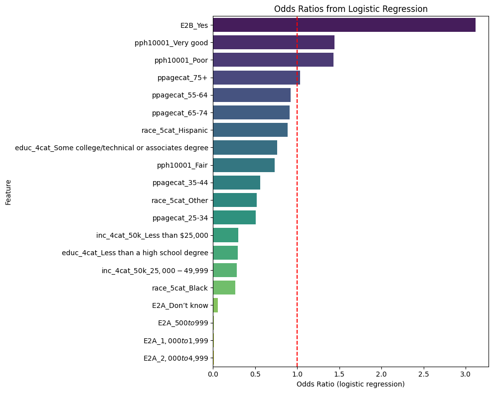
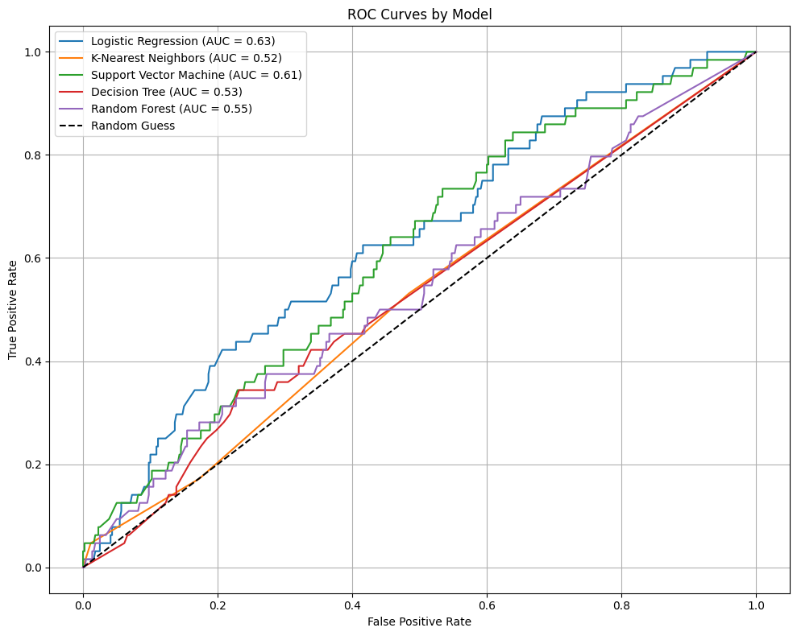
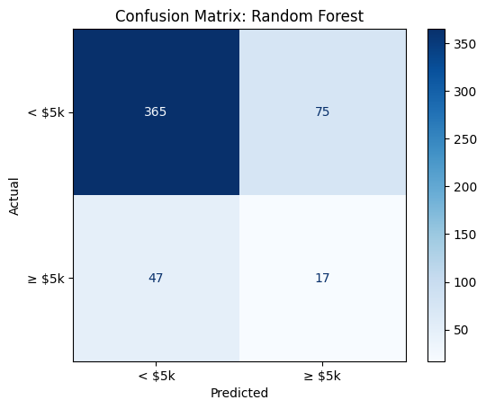
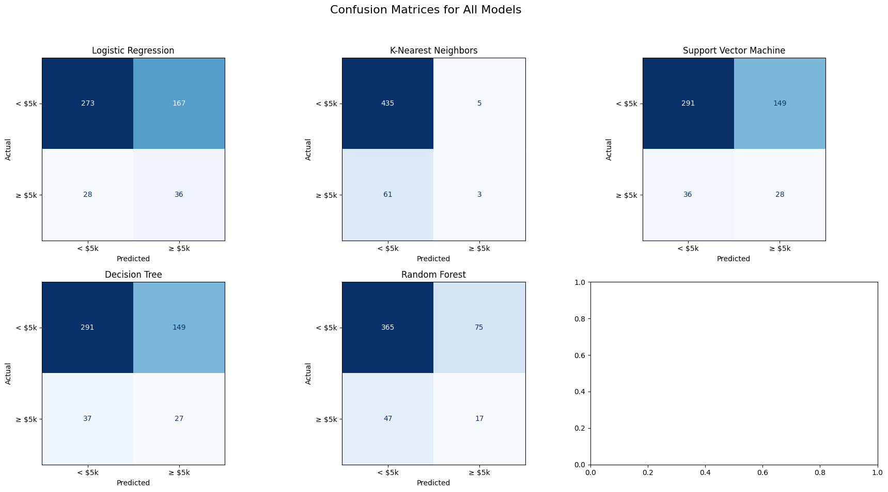
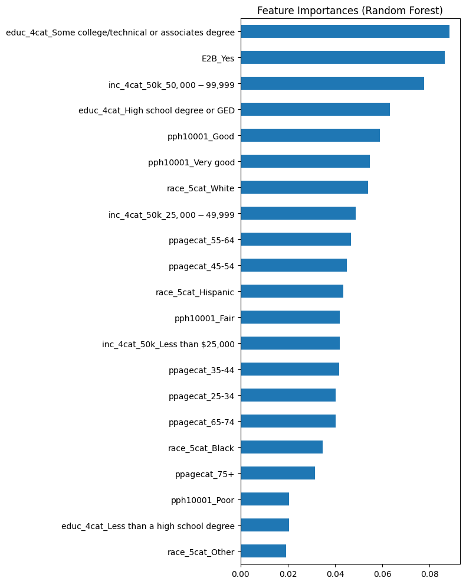
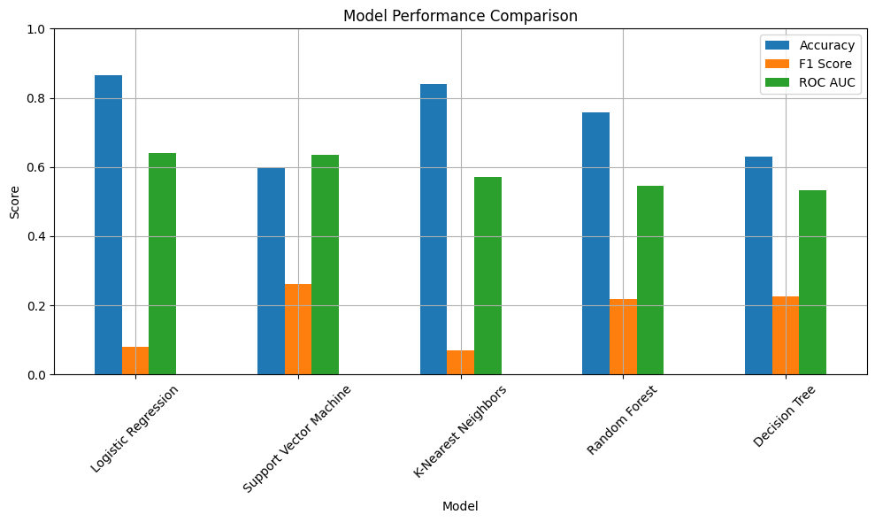

# Medical Cost Analysis DATA 303- FINAL 

## Abstract 

This paper investigates the primary socioeconomic and demographic predictors of individual medical spending in the United States, using data from the 2023 Survey of Household Economics and Decisionmaking (SHED). The analysis aims to identify which factors most significantly influence out-of-pocket medical expenses among individuals, with a particular focus on low- and middle-income populations. This study uses regression modeling, predictive analysis, and machine learning techniques to explore how variables such as income, race/ethnicity, income, education, age, and health status contribute to variations in medical spending. Given the well-documented burden of medical costs on household financial stability, this research also considers the broader implications for public policy, especially regarding access to affordable healthcare and the design of the cost-sharing mechanisms. Preliminary findings suggest that Black individuals, those with incomes between $25,000 and $49,000, and individuals with an education less than high school are among the strongest predictors of high medical expenses. These results underscore the importance of targeted interventions to mitigate medical cost burdens and reduce financial vulnerability among underserved populations. By identifying the top predictors of medical spending, this study provides evidence that can inform equitable policy and financial support programs. 


```python
pip install pandas numpy scikit-learn seaborn matplotlib
```

    Requirement already satisfied: pandas in /Library/Frameworks/Python.framework/Versions/3.12/lib/python3.12/site-packages (2.2.2)
    Requirement already satisfied: numpy in /Library/Frameworks/Python.framework/Versions/3.12/lib/python3.12/site-packages (2.0.1)
    Requirement already satisfied: scikit-learn in /Library/Frameworks/Python.framework/Versions/3.12/lib/python3.12/site-packages (1.6.1)
    Requirement already satisfied: seaborn in /Library/Frameworks/Python.framework/Versions/3.12/lib/python3.12/site-packages (0.13.2)
    Requirement already satisfied: matplotlib in /Library/Frameworks/Python.framework/Versions/3.12/lib/python3.12/site-packages (3.9.1.post1)
    Requirement already satisfied: python-dateutil>=2.8.2 in /Library/Frameworks/Python.framework/Versions/3.12/lib/python3.12/site-packages (from pandas) (2.9.0.post0)
    Requirement already satisfied: pytz>=2020.1 in /Library/Frameworks/Python.framework/Versions/3.12/lib/python3.12/site-packages (from pandas) (2024.1)
    Requirement already satisfied: tzdata>=2022.7 in /Library/Frameworks/Python.framework/Versions/3.12/lib/python3.12/site-packages (from pandas) (2024.1)
    Requirement already satisfied: scipy>=1.6.0 in /Library/Frameworks/Python.framework/Versions/3.12/lib/python3.12/site-packages (from scikit-learn) (1.15.1)
    Requirement already satisfied: joblib>=1.2.0 in /Library/Frameworks/Python.framework/Versions/3.12/lib/python3.12/site-packages (from scikit-learn) (1.4.2)
    Requirement already satisfied: threadpoolctl>=3.1.0 in /Library/Frameworks/Python.framework/Versions/3.12/lib/python3.12/site-packages (from scikit-learn) (3.5.0)
    Requirement already satisfied: contourpy>=1.0.1 in /Library/Frameworks/Python.framework/Versions/3.12/lib/python3.12/site-packages (from matplotlib) (1.2.1)
    Requirement already satisfied: cycler>=0.10 in /Library/Frameworks/Python.framework/Versions/3.12/lib/python3.12/site-packages (from matplotlib) (0.12.1)
    Requirement already satisfied: fonttools>=4.22.0 in /Library/Frameworks/Python.framework/Versions/3.12/lib/python3.12/site-packages (from matplotlib) (4.53.1)
    Requirement already satisfied: kiwisolver>=1.3.1 in /Library/Frameworks/Python.framework/Versions/3.12/lib/python3.12/site-packages (from matplotlib) (1.4.5)
    Requirement already satisfied: packaging>=20.0 in /Library/Frameworks/Python.framework/Versions/3.12/lib/python3.12/site-packages (from matplotlib) (24.1)
    Requirement already satisfied: pillow>=8 in /Library/Frameworks/Python.framework/Versions/3.12/lib/python3.12/site-packages (from matplotlib) (10.4.0)
    Requirement already satisfied: pyparsing>=2.3.1 in /Library/Frameworks/Python.framework/Versions/3.12/lib/python3.12/site-packages (from matplotlib) (3.1.2)
    Requirement already satisfied: six>=1.5 in /Library/Frameworks/Python.framework/Versions/3.12/lib/python3.12/site-packages (from python-dateutil>=2.8.2->pandas) (1.16.0)
    
    [notice] A new release of pip is available: 25.0.1 -> 25.1
    [notice] To update, run: pip install --upgrade pip
    Note: you may need to restart the kernel to use updated packages.


```python
import pandas as pd
import numpy as np
from sklearn.model_selection import train_test_split
from sklearn.linear_model import LinearRegression
from sklearn.ensemble import RandomForestRegressor
from sklearn.metrics import mean_squared_error, r2_score
from sklearn.preprocessing import StandardScaler
import seaborn as sns
import matplotlib.pyplot as plt

```


```python
df= pd.read_csv('public2023.csv')
```

    /var/folders/1g/y4xyxt251fzf_hxjy9_nvsmc0000gp/T/ipykernel_94143/3443155746.py:1: DtypeWarning: Columns (305,306,307) have mixed types. Specify dtype option on import or set low_memory=False.
      df= pd.read_csv('public2023.csv')


```python
# Inspect the first few rows and columns to understand the structure
print(df.head())
print(df.info())
```

       CaseID  caseid2022  caseid2021  caseid2020  caseid2019  duration  weight  \
    0       1         1.0         NaN         NaN         NaN      1571  0.5468   
    1       2         NaN         NaN         NaN     30003.0      1403  0.6107   
    2       3         NaN         NaN         NaN         NaN      1457  0.4587   
    3       4         NaN         NaN         NaN     30004.0      1258  1.3732   
    4       5         7.0         NaN         NaN         NaN       848  0.9264   
    
       weight_pop  panel_weight  panel_weight_pop  ... E4_e_iflag E4_f_iflag  \
    0  12368.3902        1.1745        78263.9746  ...          0          0   
    1  13814.4762           NaN               NaN  ...          0          0   
    2  10376.7351           NaN               NaN  ...          0          0   
    3  31061.3140           NaN               NaN  ...          0          0   
    4  20954.7313        1.7360       115678.4880  ...          0          0   
    
      CH2A_iflag ED4_iflag race_5cat      inc_4cat_50k  \
    0          1         0     White   $25,000-$49,999   
    1          0         0     White   $50,000-$99,999   
    2          0         0     White   $50,000-$99,999   
    3          0         0     White   $50,000-$99,999   
    4          1         0     White  $100,000 or more   
    
                                         educ_4cat pay_casheqv atleast_okay  \
    0                    Bachelor's degree or more         Yes          Yes   
    1  Some college/technical or associates degree         Yes          Yes   
    2                    Bachelor's degree or more         Yes          Yes   
    3               Less than a high school degree         Yes          Yes   
    4                    Bachelor's degree or more         Yes          Yes   
    
      control  
    0  Public  
    1  Public  
    2  Public  
    3     NaN  
    4     NaN  
    
    [5 rows x 595 columns]
    <class 'pandas.core.frame.DataFrame'>
    RangeIndex: 11400 entries, 0 to 11399
    Columns: 595 entries, CaseID to control
    dtypes: float64(20), int64(272), object(303)
    memory usage: 51.8+ MB
    None


```python
# Mapping Codebook to Categories 
race_map = {
    1: 'White',
    2: 'Black',
    3: 'Hispanic',
    4: 'Asian', 
    5: 'Other'
}

educ_map = {
    1: 'Grade School',
    2: 'High School Graduate or GED',
    3: 'Some college',
    4: 'Bachelors or more'
}

income_map = {
    1: 'Less than $25,000',
    2: '$25,000 - $49,000',
    3: '$50,000 - $99,000',
    4: '$100,000 or more'
} 


med_cost_map= { 
    -2: 'Dont know', 
    1: '$1 - $499',
    2: '$500-$999',
    3: '$1000 - $1,999',
    4: '$2,000 - $4,999', 
    5: '$5,000 or higher' 
} 
df['RACE'] = df['race_5cat'].map(race_map)
df['EDUC'] = df['educ_4cat'].map(educ_map)
df['INCOME'] = df['inc_4cat_50k'].map(income_map)
df['MED_COSTS'] = df['E2A'].map(med_cost_map) 

```


```python
df.head(25)
```


<div>
<style scoped>
    .dataframe tbody tr th:only-of-type {
        vertical-align: middle;
    }

    .dataframe tbody tr th {
        vertical-align: top;
    }

    .dataframe thead th {
        text-align: right;
    }
</style>
<table border="1" class="dataframe">
  <thead>
    <tr style="text-align: right;">
      <th></th>
      <th>CaseID</th>
      <th>caseid2022</th>
      <th>caseid2021</th>
      <th>caseid2020</th>
      <th>caseid2019</th>
      <th>duration</th>
      <th>weight</th>
      <th>weight_pop</th>
      <th>panel_weight</th>
      <th>panel_weight_pop</th>
      <th>...</th>
      <th>race_5cat</th>
      <th>inc_4cat_50k</th>
      <th>educ_4cat</th>
      <th>pay_casheqv</th>
      <th>atleast_okay</th>
      <th>control</th>
      <th>RACE</th>
      <th>EDUC</th>
      <th>INCOME</th>
      <th>MED_COSTS</th>
    </tr>
  </thead>
  <tbody>
    <tr>
      <th>0</th>
      <td>1</td>
      <td>1.0</td>
      <td>NaN</td>
      <td>NaN</td>
      <td>NaN</td>
      <td>1571</td>
      <td>0.5468</td>
      <td>12368.3902</td>
      <td>1.1745</td>
      <td>78263.9746</td>
      <td>...</td>
      <td>White</td>
      <td>$25,000-$49,999</td>
      <td>Bachelor's degree or more</td>
      <td>Yes</td>
      <td>Yes</td>
      <td>Public</td>
      <td>NaN</td>
      <td>NaN</td>
      <td>NaN</td>
      <td>NaN</td>
    </tr>
    <tr>
      <th>1</th>
      <td>2</td>
      <td>NaN</td>
      <td>NaN</td>
      <td>NaN</td>
      <td>30003.0</td>
      <td>1403</td>
      <td>0.6107</td>
      <td>13814.4762</td>
      <td>NaN</td>
      <td>NaN</td>
      <td>...</td>
      <td>White</td>
      <td>$50,000-$99,999</td>
      <td>Some college/technical or associates degree</td>
      <td>Yes</td>
      <td>Yes</td>
      <td>Public</td>
      <td>NaN</td>
      <td>NaN</td>
      <td>NaN</td>
      <td>NaN</td>
    </tr>
    <tr>
      <th>2</th>
      <td>3</td>
      <td>NaN</td>
      <td>NaN</td>
      <td>NaN</td>
      <td>NaN</td>
      <td>1457</td>
      <td>0.4587</td>
      <td>10376.7351</td>
      <td>NaN</td>
      <td>NaN</td>
      <td>...</td>
      <td>White</td>
      <td>$50,000-$99,999</td>
      <td>Bachelor's degree or more</td>
      <td>Yes</td>
      <td>Yes</td>
      <td>Public</td>
      <td>NaN</td>
      <td>NaN</td>
      <td>NaN</td>
      <td>NaN</td>
    </tr>
    <tr>
      <th>3</th>
      <td>4</td>
      <td>NaN</td>
      <td>NaN</td>
      <td>NaN</td>
      <td>30004.0</td>
      <td>1258</td>
      <td>1.3732</td>
      <td>31061.3140</td>
      <td>NaN</td>
      <td>NaN</td>
      <td>...</td>
      <td>White</td>
      <td>$50,000-$99,999</td>
      <td>Less than a high school degree</td>
      <td>Yes</td>
      <td>Yes</td>
      <td>NaN</td>
      <td>NaN</td>
      <td>NaN</td>
      <td>NaN</td>
      <td>NaN</td>
    </tr>
    <tr>
      <th>4</th>
      <td>5</td>
      <td>7.0</td>
      <td>NaN</td>
      <td>NaN</td>
      <td>NaN</td>
      <td>848</td>
      <td>0.9264</td>
      <td>20954.7313</td>
      <td>1.7360</td>
      <td>115678.4880</td>
      <td>...</td>
      <td>White</td>
      <td>$100,000 or more</td>
      <td>Bachelor's degree or more</td>
      <td>Yes</td>
      <td>Yes</td>
      <td>NaN</td>
      <td>NaN</td>
      <td>NaN</td>
      <td>NaN</td>
      <td>NaN</td>
    </tr>
    <tr>
      <th>5</th>
      <td>6</td>
      <td>NaN</td>
      <td>NaN</td>
      <td>NaN</td>
      <td>5.0</td>
      <td>1171</td>
      <td>0.7143</td>
      <td>16157.4216</td>
      <td>NaN</td>
      <td>NaN</td>
      <td>...</td>
      <td>White</td>
      <td>$100,000 or more</td>
      <td>Bachelor's degree or more</td>
      <td>Yes</td>
      <td>Yes</td>
      <td>Private nonprofit</td>
      <td>NaN</td>
      <td>NaN</td>
      <td>NaN</td>
      <td>NaN</td>
    </tr>
    <tr>
      <th>6</th>
      <td>7</td>
      <td>NaN</td>
      <td>NaN</td>
      <td>NaN</td>
      <td>6.0</td>
      <td>1452</td>
      <td>0.4300</td>
      <td>9727.2758</td>
      <td>NaN</td>
      <td>NaN</td>
      <td>...</td>
      <td>White</td>
      <td>$50,000-$99,999</td>
      <td>Bachelor's degree or more</td>
      <td>Yes</td>
      <td>Yes</td>
      <td>NaN</td>
      <td>NaN</td>
      <td>NaN</td>
      <td>NaN</td>
      <td>NaN</td>
    </tr>
    <tr>
      <th>7</th>
      <td>8</td>
      <td>NaN</td>
      <td>4.0</td>
      <td>NaN</td>
      <td>NaN</td>
      <td>1493</td>
      <td>0.7477</td>
      <td>16912.1462</td>
      <td>NaN</td>
      <td>NaN</td>
      <td>...</td>
      <td>White</td>
      <td>$25,000-$49,999</td>
      <td>High school degree or GED</td>
      <td>Yes</td>
      <td>Yes</td>
      <td>NaN</td>
      <td>NaN</td>
      <td>NaN</td>
      <td>NaN</td>
      <td>NaN</td>
    </tr>
    <tr>
      <th>8</th>
      <td>9</td>
      <td>NaN</td>
      <td>NaN</td>
      <td>NaN</td>
      <td>NaN</td>
      <td>1592</td>
      <td>0.5198</td>
      <td>11759.1221</td>
      <td>NaN</td>
      <td>NaN</td>
      <td>...</td>
      <td>White</td>
      <td>$100,000 or more</td>
      <td>Bachelor's degree or more</td>
      <td>Yes</td>
      <td>Yes</td>
      <td>Public</td>
      <td>NaN</td>
      <td>NaN</td>
      <td>NaN</td>
      <td>NaN</td>
    </tr>
    <tr>
      <th>9</th>
      <td>10</td>
      <td>NaN</td>
      <td>7.0</td>
      <td>6.0</td>
      <td>NaN</td>
      <td>4423</td>
      <td>0.6682</td>
      <td>15114.2897</td>
      <td>NaN</td>
      <td>NaN</td>
      <td>...</td>
      <td>White</td>
      <td>$25,000-$49,999</td>
      <td>Some college/technical or associates degree</td>
      <td>No</td>
      <td>No</td>
      <td>Public</td>
      <td>NaN</td>
      <td>NaN</td>
      <td>NaN</td>
      <td>NaN</td>
    </tr>
    <tr>
      <th>10</th>
      <td>11</td>
      <td>NaN</td>
      <td>NaN</td>
      <td>7.0</td>
      <td>NaN</td>
      <td>875</td>
      <td>0.5913</td>
      <td>13374.5055</td>
      <td>NaN</td>
      <td>NaN</td>
      <td>...</td>
      <td>White</td>
      <td>$25,000-$49,999</td>
      <td>Some college/technical or associates degree</td>
      <td>Yes</td>
      <td>Yes</td>
      <td>Public</td>
      <td>NaN</td>
      <td>NaN</td>
      <td>NaN</td>
      <td>NaN</td>
    </tr>
    <tr>
      <th>11</th>
      <td>12</td>
      <td>NaN</td>
      <td>NaN</td>
      <td>30013.0</td>
      <td>NaN</td>
      <td>1604</td>
      <td>0.7128</td>
      <td>16123.4228</td>
      <td>NaN</td>
      <td>NaN</td>
      <td>...</td>
      <td>White</td>
      <td>$25,000-$49,999</td>
      <td>Some college/technical or associates degree</td>
      <td>No</td>
      <td>No</td>
      <td>Public</td>
      <td>NaN</td>
      <td>NaN</td>
      <td>NaN</td>
      <td>NaN</td>
    </tr>
    <tr>
      <th>12</th>
      <td>13</td>
      <td>NaN</td>
      <td>NaN</td>
      <td>NaN</td>
      <td>NaN</td>
      <td>1509</td>
      <td>0.1679</td>
      <td>3798.4396</td>
      <td>NaN</td>
      <td>NaN</td>
      <td>...</td>
      <td>Other</td>
      <td>$25,000-$49,999</td>
      <td>Bachelor's degree or more</td>
      <td>No</td>
      <td>Yes</td>
      <td>Public</td>
      <td>NaN</td>
      <td>NaN</td>
      <td>NaN</td>
      <td>NaN</td>
    </tr>
    <tr>
      <th>13</th>
      <td>14</td>
      <td>NaN</td>
      <td>16.0</td>
      <td>14.0</td>
      <td>18.0</td>
      <td>916</td>
      <td>0.9497</td>
      <td>21483.3134</td>
      <td>NaN</td>
      <td>NaN</td>
      <td>...</td>
      <td>White</td>
      <td>$50,000-$99,999</td>
      <td>High school degree or GED</td>
      <td>Yes</td>
      <td>Yes</td>
      <td>NaN</td>
      <td>NaN</td>
      <td>NaN</td>
      <td>NaN</td>
      <td>NaN</td>
    </tr>
    <tr>
      <th>14</th>
      <td>15</td>
      <td>19.0</td>
      <td>NaN</td>
      <td>NaN</td>
      <td>NaN</td>
      <td>1200</td>
      <td>0.6543</td>
      <td>14800.4083</td>
      <td>0.7651</td>
      <td>50984.3210</td>
      <td>...</td>
      <td>White</td>
      <td>$50,000-$99,999</td>
      <td>Some college/technical or associates degree</td>
      <td>Yes</td>
      <td>No</td>
      <td>Public</td>
      <td>NaN</td>
      <td>NaN</td>
      <td>NaN</td>
      <td>NaN</td>
    </tr>
    <tr>
      <th>15</th>
      <td>16</td>
      <td>NaN</td>
      <td>NaN</td>
      <td>NaN</td>
      <td>21.0</td>
      <td>1555</td>
      <td>1.1324</td>
      <td>25614.5496</td>
      <td>NaN</td>
      <td>NaN</td>
      <td>...</td>
      <td>White</td>
      <td>$100,000 or more</td>
      <td>Bachelor's degree or more</td>
      <td>Yes</td>
      <td>Yes</td>
      <td>Private nonprofit</td>
      <td>NaN</td>
      <td>NaN</td>
      <td>NaN</td>
      <td>NaN</td>
    </tr>
    <tr>
      <th>16</th>
      <td>17</td>
      <td>20.0</td>
      <td>NaN</td>
      <td>17.0</td>
      <td>24.0</td>
      <td>833</td>
      <td>1.0917</td>
      <td>24695.5650</td>
      <td>0.7228</td>
      <td>48162.4097</td>
      <td>...</td>
      <td>White</td>
      <td>$100,000 or more</td>
      <td>Some college/technical or associates degree</td>
      <td>Yes</td>
      <td>Yes</td>
      <td>Public</td>
      <td>NaN</td>
      <td>NaN</td>
      <td>NaN</td>
      <td>NaN</td>
    </tr>
    <tr>
      <th>17</th>
      <td>18</td>
      <td>22.0</td>
      <td>NaN</td>
      <td>22.0</td>
      <td>28.0</td>
      <td>1132</td>
      <td>1.8960</td>
      <td>42887.3729</td>
      <td>2.4243</td>
      <td>161538.1340</td>
      <td>...</td>
      <td>Asian</td>
      <td>$100,000 or more</td>
      <td>Some college/technical or associates degree</td>
      <td>Yes</td>
      <td>Yes</td>
      <td>Public</td>
      <td>NaN</td>
      <td>NaN</td>
      <td>NaN</td>
      <td>NaN</td>
    </tr>
    <tr>
      <th>18</th>
      <td>19</td>
      <td>23.0</td>
      <td>22.0</td>
      <td>23.0</td>
      <td>NaN</td>
      <td>2414</td>
      <td>1.1344</td>
      <td>25660.1137</td>
      <td>0.5776</td>
      <td>38484.7950</td>
      <td>...</td>
      <td>Other</td>
      <td>$100,000 or more</td>
      <td>High school degree or GED</td>
      <td>Yes</td>
      <td>Yes</td>
      <td>NaN</td>
      <td>NaN</td>
      <td>NaN</td>
      <td>NaN</td>
      <td>NaN</td>
    </tr>
    <tr>
      <th>19</th>
      <td>20</td>
      <td>NaN</td>
      <td>NaN</td>
      <td>NaN</td>
      <td>NaN</td>
      <td>1123</td>
      <td>0.6896</td>
      <td>15598.8475</td>
      <td>NaN</td>
      <td>NaN</td>
      <td>...</td>
      <td>White</td>
      <td>$25,000-$49,999</td>
      <td>High school degree or GED</td>
      <td>Yes</td>
      <td>Yes</td>
      <td>NaN</td>
      <td>NaN</td>
      <td>NaN</td>
      <td>NaN</td>
      <td>NaN</td>
    </tr>
    <tr>
      <th>20</th>
      <td>21</td>
      <td>27.0</td>
      <td>NaN</td>
      <td>NaN</td>
      <td>NaN</td>
      <td>1527</td>
      <td>0.6653</td>
      <td>15049.3578</td>
      <td>1.2942</td>
      <td>86237.1143</td>
      <td>...</td>
      <td>White</td>
      <td>$50,000-$99,999</td>
      <td>Some college/technical or associates degree</td>
      <td>Yes</td>
      <td>Yes</td>
      <td>Public</td>
      <td>NaN</td>
      <td>NaN</td>
      <td>NaN</td>
      <td>NaN</td>
    </tr>
    <tr>
      <th>21</th>
      <td>22</td>
      <td>28.0</td>
      <td>26.0</td>
      <td>26.0</td>
      <td>36.0</td>
      <td>2206</td>
      <td>1.6770</td>
      <td>37934.9344</td>
      <td>0.7922</td>
      <td>52783.5629</td>
      <td>...</td>
      <td>White</td>
      <td>$100,000 or more</td>
      <td>High school degree or GED</td>
      <td>Yes</td>
      <td>Yes</td>
      <td>NaN</td>
      <td>NaN</td>
      <td>NaN</td>
      <td>NaN</td>
      <td>NaN</td>
    </tr>
    <tr>
      <th>22</th>
      <td>23</td>
      <td>NaN</td>
      <td>NaN</td>
      <td>NaN</td>
      <td>39.0</td>
      <td>1344</td>
      <td>0.6669</td>
      <td>15086.4017</td>
      <td>NaN</td>
      <td>NaN</td>
      <td>...</td>
      <td>White</td>
      <td>$25,000-$49,999</td>
      <td>High school degree or GED</td>
      <td>Yes</td>
      <td>No</td>
      <td>NaN</td>
      <td>NaN</td>
      <td>NaN</td>
      <td>NaN</td>
      <td>NaN</td>
    </tr>
    <tr>
      <th>23</th>
      <td>24</td>
      <td>NaN</td>
      <td>NaN</td>
      <td>NaN</td>
      <td>40.0</td>
      <td>2595</td>
      <td>0.6667</td>
      <td>15081.0918</td>
      <td>NaN</td>
      <td>NaN</td>
      <td>...</td>
      <td>White</td>
      <td>$100,000 or more</td>
      <td>Bachelor's degree or more</td>
      <td>Yes</td>
      <td>Yes</td>
      <td>Private nonprofit</td>
      <td>NaN</td>
      <td>NaN</td>
      <td>NaN</td>
      <td>NaN</td>
    </tr>
    <tr>
      <th>24</th>
      <td>25</td>
      <td>NaN</td>
      <td>NaN</td>
      <td>29.0</td>
      <td>NaN</td>
      <td>1691</td>
      <td>1.0308</td>
      <td>23316.3191</td>
      <td>NaN</td>
      <td>NaN</td>
      <td>...</td>
      <td>Other</td>
      <td>$25,000-$49,999</td>
      <td>Bachelor's degree or more</td>
      <td>Yes</td>
      <td>No</td>
      <td>Public</td>
      <td>NaN</td>
      <td>NaN</td>
      <td>NaN</td>
      <td>NaN</td>
    </tr>
  </tbody>
</table>
<p>25 rows × 599 columns</p>
</div>


```python
df = df.loc[:, [
    'race_5cat',
    'inc_4cat_50k',
    'educ_4cat',
    'ppagecat',
    'E2A', 'E2B',
    'pph10001'
]]
```


```python
df.head(10)
```


<div>
<style scoped>
    .dataframe tbody tr th:only-of-type {
        vertical-align: middle;
    }

    .dataframe tbody tr th {
        vertical-align: top;
    }

    .dataframe thead th {
        text-align: right;
    }
</style>
<table border="1" class="dataframe">
  <thead>
    <tr style="text-align: right;">
      <th></th>
      <th>race_5cat</th>
      <th>inc_4cat_50k</th>
      <th>educ_4cat</th>
      <th>ppagecat</th>
      <th>E2A</th>
      <th>E2B</th>
      <th>pph10001</th>
    </tr>
  </thead>
  <tbody>
    <tr>
      <th>0</th>
      <td>White</td>
      <td>$25,000-$49,999</td>
      <td>Bachelor's degree or more</td>
      <td>75+</td>
      <td>NaN</td>
      <td>No</td>
      <td>Fair</td>
    </tr>
    <tr>
      <th>1</th>
      <td>White</td>
      <td>$50,000-$99,999</td>
      <td>Some college/technical or associates degree</td>
      <td>75+</td>
      <td>NaN</td>
      <td>No</td>
      <td>Good</td>
    </tr>
    <tr>
      <th>2</th>
      <td>White</td>
      <td>$50,000-$99,999</td>
      <td>Bachelor's degree or more</td>
      <td>75+</td>
      <td>$1,000 to $1,999</td>
      <td>No</td>
      <td>Very good</td>
    </tr>
    <tr>
      <th>3</th>
      <td>White</td>
      <td>$50,000-$99,999</td>
      <td>Less than a high school degree</td>
      <td>55-64</td>
      <td>NaN</td>
      <td>No</td>
      <td>Very good</td>
    </tr>
    <tr>
      <th>4</th>
      <td>White</td>
      <td>$100,000 or more</td>
      <td>Bachelor's degree or more</td>
      <td>55-64</td>
      <td>$2,000 to $4,999</td>
      <td>No</td>
      <td>Good</td>
    </tr>
    <tr>
      <th>5</th>
      <td>White</td>
      <td>$100,000 or more</td>
      <td>Bachelor's degree or more</td>
      <td>75+</td>
      <td>NaN</td>
      <td>No</td>
      <td>Good</td>
    </tr>
    <tr>
      <th>6</th>
      <td>White</td>
      <td>$50,000-$99,999</td>
      <td>Bachelor's degree or more</td>
      <td>55-64</td>
      <td>NaN</td>
      <td>No</td>
      <td>Fair</td>
    </tr>
    <tr>
      <th>7</th>
      <td>White</td>
      <td>$25,000-$49,999</td>
      <td>High school degree or GED</td>
      <td>75+</td>
      <td>NaN</td>
      <td>No</td>
      <td>Fair</td>
    </tr>
    <tr>
      <th>8</th>
      <td>White</td>
      <td>$100,000 or more</td>
      <td>Bachelor's degree or more</td>
      <td>75+</td>
      <td>NaN</td>
      <td>No</td>
      <td>Good</td>
    </tr>
    <tr>
      <th>9</th>
      <td>White</td>
      <td>$25,000-$49,999</td>
      <td>Some college/technical or associates degree</td>
      <td>55-64</td>
      <td>NaN</td>
      <td>No</td>
      <td>Good</td>
    </tr>
  </tbody>
</table>
</div>


```python
# Check for missing data
print(df.isnull().sum())

```

    race_5cat          0
    inc_4cat_50k       0
    educ_4cat          0
    ppagecat           0
    E2A             8676
    E2B                0
    pph10001         793
    dtype: int64


```python
df.dropna(subset=['E2A', 'pph10001'], inplace=True)

```


```python
# One-hot encode categorical variables (RACE, EDUC, AGE_RANGE)
df = pd.get_dummies(df, columns=['race_5cat', 'inc_4cat_50k', 'educ_4cat', 'ppagecat', 'E2A', 'E2B', 'pph10001'], drop_first=True)

# Check the transformed dataframe
print(df.head())

```

        race_5cat_Black  race_5cat_Hispanic  race_5cat_Other  race_5cat_White  \
    2             False               False            False             True   
    4             False               False            False             True   
    11            False               False            False             True   
    12            False               False             True            False   
    14            False               False            False             True   
    
        inc_4cat_50k_$25,000-$49,999  inc_4cat_50k_$50,000-$99,999  \
    2                          False                          True   
    4                          False                         False   
    11                          True                         False   
    12                          True                         False   
    14                         False                          True   
    
        inc_4cat_50k_Less than $25,000  educ_4cat_High school degree or GED  \
    2                            False                                False   
    4                            False                                False   
    11                           False                                False   
    12                           False                                False   
    14                           False                                False   
    
        educ_4cat_Less than a high school degree  \
    2                                      False   
    4                                      False   
    11                                     False   
    12                                     False   
    14                                     False   
    
        educ_4cat_Some college/technical or associates degree  ...  \
    2                                               False      ...   
    4                                               False      ...   
    11                                               True      ...   
    12                                              False      ...   
    14                                               True      ...   
    
        E2A_$1,000 to $1,999  E2A_$2,000 to $4,999  E2A_$5,000 or higher  \
    2                   True                 False                 False   
    4                  False                  True                 False   
    11                 False                 False                 False   
    12                 False                  True                 False   
    14                 False                 False                 False   
    
        E2A_$500 to $999  E2A_Don’t know  E2B_Yes  pph10001_Fair  pph10001_Good  \
    2              False           False    False          False          False   
    4              False           False    False          False           True   
    11             False           False    False           True          False   
    12             False           False    False          False           True   
    14             False           False    False          False           True   
    
        pph10001_Poor  pph10001_Very good  
    2           False                True  
    4           False               False  
    11          False               False  
    12          False               False  
    14          False               False  
    
    [5 rows x 26 columns]


```python
# Run stats model to show the effect of all features on the outcome variable 

import statsmodels.api as sm
import pandas as pd
```


```python
features = [
    'race_5cat_Black', 'race_5cat_Hispanic', 'race_5cat_Other', 'race_5cat_White',
    'inc_4cat_50k_$25,000-$49,999', 'inc_4cat_50k_$50,000-$99,999', 'inc_4cat_50k_Less than $25,000',
    'educ_4cat_High school degree or GED', 'educ_4cat_Less than a high school degree', 'educ_4cat_Some college/technical or associates degree',
    'ppagecat_25-34', 'ppagecat_35-44', 'ppagecat_45-54', 'ppagecat_55-64', 'ppagecat_65-74', 'ppagecat_75+',
    'E2B_Yes', 'pph10001_Fair', 'pph10001_Good', 'pph10001_Poor', 'pph10001_Very good'
]
```


```python
X = df[features].copy()
y = df['E2A_$5,000 or higher'].copy()
```


```python
X = X.apply(pd.to_numeric, errors='coerce')
y = pd.to_numeric(y, errors='coerce')
```


```python
combined = pd.concat([X, y], axis=1).dropna()
X = combined[features]
y = combined['E2A_$5,000 or higher']
```


```python
print(X.dtypes)
print(y.dtypes)
```

    race_5cat_Black                                          bool
    race_5cat_Hispanic                                       bool
    race_5cat_Other                                          bool
    race_5cat_White                                          bool
    inc_4cat_50k_$25,000-$49,999                             bool
    inc_4cat_50k_$50,000-$99,999                             bool
    inc_4cat_50k_Less than $25,000                           bool
    educ_4cat_High school degree or GED                      bool
    educ_4cat_Less than a high school degree                 bool
    educ_4cat_Some college/technical or associates degree    bool
    ppagecat_25-34                                           bool
    ppagecat_35-44                                           bool
    ppagecat_45-54                                           bool
    ppagecat_55-64                                           bool
    ppagecat_65-74                                           bool
    ppagecat_75+                                             bool
    E2B_Yes                                                  bool
    pph10001_Fair                                            bool
    pph10001_Good                                            bool
    pph10001_Poor                                            bool
    pph10001_Very good                                       bool
    dtype: object
    bool


```python
X = X.astype(int)
```


```python
X = sm.add_constant(X)
model = sm.Logit(y, X)
results = model.fit()
```

    Optimization terminated successfully.
             Current function value: 0.362465
             Iterations 7


```python
print(results.summary())
```

                                Logit Regression Results                            
    ================================================================================
    Dep. Variable:     E2A_$5,000 or higher   No. Observations:                 2520
    Model:                            Logit   Df Residuals:                     2498
    Method:                             MLE   Df Model:                           21
    Date:                  Wed, 30 Apr 2025   Pseudo R-squ.:                 0.04768
    Time:                          18:49:02   Log-Likelihood:                -913.41
    converged:                         True   LL-Null:                       -959.15
    Covariance Type:              nonrobust   LLR p-value:                 9.005e-11
    =========================================================================================================================
                                                                coef    std err          z      P>|z|      [0.025      0.975]
    -------------------------------------------------------------------------------------------------------------------------
    const                                                    -1.1100      0.497     -2.232      0.026      -2.085      -0.135
    race_5cat_Black                                          -0.6792      0.388     -1.750      0.080      -1.440       0.082
    race_5cat_Hispanic                                        0.0209      0.344      0.061      0.952      -0.654       0.696
    race_5cat_Other                                          -0.4657      0.446     -1.044      0.297      -1.340       0.409
    race_5cat_White                                          -0.1342      0.312     -0.431      0.667      -0.745       0.477
    inc_4cat_50k_$25,000-$49,999                             -0.8091      0.215     -3.761      0.000      -1.231      -0.387
    inc_4cat_50k_$50,000-$99,999                             -0.2688      0.150     -1.790      0.074      -0.563       0.026
    inc_4cat_50k_Less than $25,000                           -0.6311      0.252     -2.507      0.012      -1.125      -0.138
    educ_4cat_High school degree or GED                      -0.5101      0.205     -2.487      0.013      -0.912      -0.108
    educ_4cat_Less than a high school degree                 -1.1339      0.489     -2.320      0.020      -2.092      -0.176
    educ_4cat_Some college/technical or associates degree    -0.2825      0.147     -1.917      0.055      -0.571       0.006
    ppagecat_25-34                                           -0.3450      0.400     -0.863      0.388      -1.129       0.439
    ppagecat_35-44                                           -0.4443      0.399     -1.115      0.265      -1.226       0.337
    ppagecat_45-54                                           -0.0943      0.392     -0.241      0.810      -0.862       0.673
    ppagecat_55-64                                            0.0492      0.382      0.129      0.898      -0.699       0.797
    ppagecat_65-74                                           -0.0030      0.387     -0.008      0.994      -0.762       0.756
    ppagecat_75+                                              0.0833      0.411      0.203      0.839      -0.722       0.889
    E2B_Yes                                                   0.8042      0.132      6.073      0.000       0.545       1.064
    pph10001_Fair                                            -0.6206      0.279     -2.224      0.026      -1.167      -0.074
    pph10001_Good                                            -0.5431      0.239     -2.269      0.023      -1.012      -0.074
    pph10001_Poor                                             0.1474      0.375      0.394      0.694      -0.587       0.882
    pph10001_Very good                                       -0.3122      0.238     -1.310      0.190      -0.779       0.155
    =========================================================================================================================


```python
# Define target
y = df['E2A_$5,000 or higher']  # Binary target: 1 = yes, 0 = no

# Drop all the one-hot encoded versions of E2A from features to avoid leakage
e2a_columns = [col for col in df.columns if col.startswith('E2A_')]
X = df.drop(columns=e2a_columns + ['E2A_$5,000 or higher'])  
```


```python
print("Features used:\n", X.columns.tolist())
```

    Features used:
     ['race_5cat_Black', 'race_5cat_Hispanic', 'race_5cat_Other', 'race_5cat_White', 'inc_4cat_50k_$25,000-$49,999', 'inc_4cat_50k_$50,000-$99,999', 'inc_4cat_50k_Less than $25,000', 'educ_4cat_High school degree or GED', 'educ_4cat_Less than a high school degree', 'educ_4cat_Some college/technical or associates degree', 'ppagecat_25-34', 'ppagecat_35-44', 'ppagecat_45-54', 'ppagecat_55-64', 'ppagecat_65-74', 'ppagecat_75+', 'E2B_Yes', 'pph10001_Fair', 'pph10001_Good', 'pph10001_Poor', 'pph10001_Very good']


```python
# Drop one dummy from each group (set reference)
X_cleaned = df.drop(columns=[
    'race_5cat_White',  # Reference: White
    'inc_4cat_50k_$50,000-$99,999',  # Reference: $50k–$99k
    'educ_4cat_High school degree or GED',  # Reference: HS grad
    'ppagecat_45-54',  # Reference: age 45–54
    'pph10001_Good',  # Reference: Good health
    'E2A_$5,000 or higher'  # Ensure this is dropped if still present
])
```


```python
y = df['E2A_$5,000 or higher']
X = X_cleaned
```


```python
X_train, X_test, y_train, y_test = train_test_split(X, y, test_size=0.2, random_state=42)
```

Variable Set	Reference Category (Implied)

race_5cat_*	Race group not listed (likely "Asian" or "Other" if you dropped all others manually)

inc_4cat_50k_*	$100,000 or more (since all lower categories are removed)

educ_4cat_*	Bachelor’s degree or higher (if dropped all others)

E2B_Yes	No (Have medical debt)

pph10001_*	Excellent health (all other statuses)


```python
## Logistic Regression 

from sklearn.linear_model import LogisticRegression
from sklearn.model_selection import train_test_split
from sklearn.metrics import classification_report, confusion_matrix, roc_auc_score

# Split data
X_train, X_test, y_train, y_test = train_test_split(X, y, test_size=0.2, random_state=42)

# Initialize and train logistic regression
logreg = LogisticRegression(max_iter=1000)
logreg.fit(X_train, y_train)

# Predict and evaluate
y_pred = logreg.predict(X_test)
y_proba = logreg.predict_proba(X_test)[:, 1]

print("Classification Report:\n", classification_report(y_test, y_pred))
print("Confusion Matrix:\n", confusion_matrix(y_test, y_pred))
print("ROC AUC Score:", roc_auc_score(y_test, y_proba))

# View model coefficients
coeff_df = pd.DataFrame({
    'Feature': X.columns,
    'Coefficient': logreg.coef_[0]
}).sort_values(by='Coefficient', ascending=False)

print("\nTop Predictors:\n", coeff_df)

```

    Classification Report:
                   precision    recall  f1-score   support
    
           False       0.93      0.96      0.94       446
            True       0.55      0.41      0.47        58
    
        accuracy                           0.89       504
       macro avg       0.74      0.68      0.71       504
    weighted avg       0.88      0.89      0.89       504
    
    Confusion Matrix:
     [[426  20]
     [ 34  24]]
    ROC AUC Score: 0.928212463275089
    
    Top Predictors:
                                                   Feature  Coefficient
    16                                            E2B_Yes     1.136806
    19                                 pph10001_Very good     0.365232
    18                                      pph10001_Poor     0.356980
    11                                       ppagecat_75+     0.030942
    9                                      ppagecat_55-64    -0.079605
    10                                     ppagecat_65-74    -0.092633
    1                                  race_5cat_Hispanic    -0.122892
    6   educ_4cat_Some college/technical or associates...    -0.272811
    17                                      pph10001_Fair    -0.311403
    8                                      ppagecat_35-44    -0.576243
    2                                     race_5cat_Other    -0.657428
    7                                      ppagecat_25-34    -0.679678
    4                      inc_4cat_50k_Less than $25,000    -1.208650
    5            educ_4cat_Less than a high school degree    -1.230554
    3                        inc_4cat_50k_$25,000-$49,999    -1.257744
    0                                     race_5cat_Black    -1.336448
    15                                     E2A_Don’t know    -2.902252
    14                                   E2A_$500 to $999    -4.409965
    12                               E2A_$1,000 to $1,999    -4.505846
    13                               E2A_$2,000 to $4,999    -4.729400


```python
import numpy as np
import pandas as pd
import matplotlib.pyplot as plt
import seaborn as sns
from sklearn.metrics import confusion_matrix, ConfusionMatrixDisplay

# Confusion matrix data
cm = np.array([[426, 20],
               [34, 24]])

# Top predictors
features = [
    "E2B_Yes", "pph10001_Very good", "pph10001_Poor", "ppagecat_75+", 
    "ppagecat_55-64", "ppagecat_65-74", "race_5cat_Hispanic", 
    "educ_4cat_Some college/technical or associates degree", "pph10001_Fair", 
    "ppagecat_35-44", "race_5cat_Other", "ppagecat_25-34",
    "inc_4cat_50k_Less than $25,000", "educ_4cat_Less than a high school degree", 
    "inc_4cat_50k_$25,000-$49,999", "race_5cat_Black", "E2A_Don’t know", 
    "E2A_$500 to $999", "E2A_$1,000 to $1,999", "E2A_$2,000 to $4,999"
]
coefficients = [
    1.136806, 0.365232, 0.356980, 0.030942, -0.079605, -0.092633, 
    -0.122892, -0.272811, -0.311403, -0.576243, -0.657428, -0.679678,
    -1.208650, -1.230554, -1.257744, -1.336448, -2.902252, -4.409965, 
    -4.505846, -4.729400
]

predictor_df = pd.DataFrame({
    "Feature": features,
    "Coefficient": coefficients
})

# ===== Visual 1: Confusion Matrix Heatmap =====
plt.figure(figsize=(6,5))
sns.heatmap(cm, annot=True, fmt='d', cmap='Blues', cbar=False)
plt.title('Confusion Matrix')
plt.xlabel('Predicted')
plt.ylabel('Actual')
plt.show()

# Sort features by coefficient value
predictor_df_sorted = predictor_df.sort_values("Coefficient", ascending=False)

plt.figure(figsize=(10,7))
sns.barplot(x="Coefficient", y="Feature", data=predictor_df_sorted, palette='coolwarm')
plt.axvline(x=0, color='black', linewidth=0.8)
plt.title('Top Predictors for Outcome')
plt.xlabel('Coefficient Value')
plt.ylabel('Feature')
plt.show()

#  Classification Report 

classification_data = {
    "Class": ["False", "True"],
    "Precision": [0.93, 0.55],
    "Recall": [0.96, 0.41],
    "F1-score": [0.94, 0.47],
    "Support": [446, 58]
}
classification_df = pd.DataFrame(classification_data)

# Add overall metrics
macro_avg = {"Class": "Macro Avg", "Precision": 0.74, "Recall": 0.68, "F1-score": 0.71, "Support": 504}
weighted_avg = {"Class": "Weighted Avg", "Precision": 0.88, "Recall": 0.89, "F1-score": 0.89, "Support": 504}
classification_df = pd.concat([classification_df, pd.DataFrame([macro_avg, weighted_avg])], ignore_index=True)


classification_df.style.set_caption("Classification Report").format(precision=2)

```


    

    


    /var/folders/1g/y4xyxt251fzf_hxjy9_nvsmc0000gp/T/ipykernel_94143/338256371.py:45: FutureWarning: 
    
    Passing `palette` without assigning `hue` is deprecated and will be removed in v0.14.0. Assign the `y` variable to `hue` and set `legend=False` for the same effect.
    
      sns.barplot(x="Coefficient", y="Feature", data=predictor_df_sorted, palette='coolwarm')


    

    


<style type="text/css">
</style>
<table id="T_d803d">
  <caption>Classification Report</caption>
  <thead>
    <tr>
      <th class="blank level0" >&nbsp;</th>
      <th id="T_d803d_level0_col0" class="col_heading level0 col0" >Class</th>
      <th id="T_d803d_level0_col1" class="col_heading level0 col1" >Precision</th>
      <th id="T_d803d_level0_col2" class="col_heading level0 col2" >Recall</th>
      <th id="T_d803d_level0_col3" class="col_heading level0 col3" >F1-score</th>
      <th id="T_d803d_level0_col4" class="col_heading level0 col4" >Support</th>
    </tr>
  </thead>
  <tbody>
    <tr>
      <th id="T_d803d_level0_row0" class="row_heading level0 row0" >0</th>
      <td id="T_d803d_row0_col0" class="data row0 col0" >False</td>
      <td id="T_d803d_row0_col1" class="data row0 col1" >0.93</td>
      <td id="T_d803d_row0_col2" class="data row0 col2" >0.96</td>
      <td id="T_d803d_row0_col3" class="data row0 col3" >0.94</td>
      <td id="T_d803d_row0_col4" class="data row0 col4" >446</td>
    </tr>
    <tr>
      <th id="T_d803d_level0_row1" class="row_heading level0 row1" >1</th>
      <td id="T_d803d_row1_col0" class="data row1 col0" >True</td>
      <td id="T_d803d_row1_col1" class="data row1 col1" >0.55</td>
      <td id="T_d803d_row1_col2" class="data row1 col2" >0.41</td>
      <td id="T_d803d_row1_col3" class="data row1 col3" >0.47</td>
      <td id="T_d803d_row1_col4" class="data row1 col4" >58</td>
    </tr>
    <tr>
      <th id="T_d803d_level0_row2" class="row_heading level0 row2" >2</th>
      <td id="T_d803d_row2_col0" class="data row2 col0" >Macro Avg</td>
      <td id="T_d803d_row2_col1" class="data row2 col1" >0.74</td>
      <td id="T_d803d_row2_col2" class="data row2 col2" >0.68</td>
      <td id="T_d803d_row2_col3" class="data row2 col3" >0.71</td>
      <td id="T_d803d_row2_col4" class="data row2 col4" >504</td>
    </tr>
    <tr>
      <th id="T_d803d_level0_row3" class="row_heading level0 row3" >3</th>
      <td id="T_d803d_row3_col0" class="data row3 col0" >Weighted Avg</td>
      <td id="T_d803d_row3_col1" class="data row3 col1" >0.88</td>
      <td id="T_d803d_row3_col2" class="data row3 col2" >0.89</td>
      <td id="T_d803d_row3_col3" class="data row3 col3" >0.89</td>
      <td id="T_d803d_row3_col4" class="data row3 col4" >504</td>
    </tr>
  </tbody>
</table>


## Interpretation 

### AUC 
AUC (Area Under the ROC Curve) of 0.93 means the model is very good at ranking people by their risk of spending ≥$5k.

Even though the model isn’t perfectly calibrated (see low recall for True class), it’s distinguishing high vs low OOP spenders well in terms of probability.

###  Confusion matrix

False Negatives (20): Model missed 20 people who actually spent ≥$5k.

False Positives (34): Model predicted ≥$5k for 34 people who didn’t.

True Positives (24): Only 24 correct hits on high OOP.

True Negatives (426): Most predictions are for people under $5k — and it gets those mostly right.

### Predictors


#### Positive 
E2B_Yes	1.14	People who had a medical bill they couldn't pay are much more likely to spend ≥$5k.

pph10001_Very good	0.37	Surprisingly, people in very good health are more likely to spend ≥$5k than those in "good" health (reference).

pph10001_Poor	0.36	Also intuitive: poor health increases odds of high costs.

ppagecat_75+	0.03	Slight increase with older age (reference is likely 45–54).

Takeaway: Both bad health and financial difficulty are strongly linked to high OOP spending — but even “very good” health might be catching people with proactive, costly care (like elective procedures, preventive testing, etc.).


#### Negative 


race_5cat_Black:	-1.34: Black individuals are less likely than White (reference) to spend ≥$5k.

inc_4cat_50k_Less than $25,000:	-1.21:	Low-income households are much less likely to spend ≥$5k.

E2A_$500 to $999 to E2A_$2,000 to $4,999:	~ -4.4 to -4.7: 	People who previously reported lower OOP spending are, of course, much less likely to hit the $5k+ level.

ppagecat_25-34, ppagecat_35-44:	~ -0.5 to -0.7:	Younger adults are less likely to spend ≥$5k compared to 45–54 (reference).

educ_4cat_Less than a high school degree:	-1.23:	Lower education levels correlate with lower high OOP spending — possibly due to underutilization or access issues.

#### Overall 

Health status, age, and financial hardship are big predictors of high medical spending.

People with low income, lower education, and who are younger or Black are less likely to spend ≥$5k — potentially due to barriers in accessing care or lower utilization.

Some surprising signals, like “very good” health increasing odds, might reflect complex real-world behaviors (e.g., preventive services still being costly).


```python
print(df.columns)

```

    Index(['race_5cat_Black', 'race_5cat_Hispanic', 'race_5cat_Other',
           'race_5cat_White', 'inc_4cat_50k_$25,000-$49,999',
           'inc_4cat_50k_$50,000-$99,999', 'inc_4cat_50k_Less than $25,000',
           'educ_4cat_High school degree or GED',
           'educ_4cat_Less than a high school degree',
           'educ_4cat_Some college/technical or associates degree',
           'ppagecat_25-34', 'ppagecat_35-44', 'ppagecat_45-54', 'ppagecat_55-64',
           'ppagecat_65-74', 'ppagecat_75+', 'E2A_$1,000 to $1,999',
           'E2A_$2,000 to $4,999', 'E2A_$5,000 or higher', 'E2A_$500 to $999',
           'E2A_Don’t know', 'E2B_Yes', 'pph10001_Fair', 'pph10001_Good',
           'pph10001_Poor', 'pph10001_Very good'],
          dtype='object')


```python
import pandas as pd
import numpy as np
import matplotlib.pyplot as plt
import seaborn as sns

# Get coefficients and compute odds ratios
coef_df = pd.DataFrame({
    'Feature': X.columns,
    'Coefficient': logreg.coef_[0]
})
coef_df['Odds Ratio'] = np.exp(coef_df['Coefficient'])

# Sort by magnitude of effect
coef_df = coef_df.sort_values(by='Odds Ratio', ascending=False)

# Plot
plt.figure(figsize=(10, 8))
sns.barplot(data=coef_df, x='Odds Ratio', y='Feature', palette='viridis')
plt.axvline(x=1, color='red', linestyle='--')  # Reference line at OR = 1
plt.title('Odds Ratios from Logistic Regression')
plt.xlabel('Odds Ratio (logistic regression)')
plt.ylabel('Feature')
plt.tight_layout()
plt.show()

```

    /var/folders/1g/y4xyxt251fzf_hxjy9_nvsmc0000gp/T/ipykernel_94143/2377119993.py:18: FutureWarning: 
    
    Passing `palette` without assigning `hue` is deprecated and will be removed in v0.14.0. Assign the `y` variable to `hue` and set `legend=False` for the same effect.
    
      sns.barplot(data=coef_df, x='Odds Ratio', y='Feature', palette='viridis')


    

    


```python
import pandas as pd
import numpy as np
import matplotlib.pyplot as plt
import seaborn as sns

from sklearn.model_selection import train_test_split
from sklearn.preprocessing import StandardScaler
from sklearn.metrics import classification_report, confusion_matrix, roc_auc_score, roc_curve

from sklearn.linear_model import LogisticRegression
from sklearn.neighbors import KNeighborsClassifier
from sklearn.svm import SVC
from sklearn.tree import DecisionTreeClassifier
from sklearn.ensemble import RandomForestClassifier

# Data Preparation 
feature_cols = [
    'race_5cat_Black', 'race_5cat_Hispanic', 'race_5cat_Other', 'race_5cat_White',
    'inc_4cat_50k_$25,000-$49,999', 'inc_4cat_50k_$50,000-$99,999', 'inc_4cat_50k_Less than $25,000',
    'educ_4cat_High school degree or GED', 'educ_4cat_Less than a high school degree',
    'educ_4cat_Some college/technical or associates degree',
    'ppagecat_25-34', 'ppagecat_35-44', 'ppagecat_45-54', 'ppagecat_55-64', 'ppagecat_65-74', 'ppagecat_75+',
    'E2B_Yes', 'pph10001_Fair', 'pph10001_Good', 'pph10001_Poor', 'pph10001_Very good'
]

X = df[feature_cols]
y = df['E2A_$5,000 or higher']

# Train-test split
X_train, X_test, y_train, y_test = train_test_split(X, y, stratify=y, test_size=0.2, random_state=42)

# Standardize numeric models
scaler = StandardScaler()
X_train_scaled = scaler.fit_transform(X_train)
X_test_scaled = scaler.transform(X_test)

#  Initialize Models 
models = {
    'Logistic Regression': LogisticRegression(max_iter=1000, class_weight='balanced'),
    'K-Nearest Neighbors': KNeighborsClassifier(n_neighbors=5),
    'Support Vector Machine': SVC(probability=True, kernel='rbf', class_weight='balanced'),
    'Decision Tree': DecisionTreeClassifier(class_weight='balanced', random_state=42),
    'Random Forest': RandomForestClassifier(n_estimators=100, class_weight='balanced', random_state=42)
}

#  Train and Evaluate Models 
print("=== Model Evaluation Metrics ===\n")
for name, model in models.items():
    # Scale if necessary
    if name in ['Decision Tree', 'Random Forest']:
        model.fit(X_train, y_train)
        y_pred = model.predict(X_test)
        y_proba = model.predict_proba(X_test)[:, 1]
    else:
        model.fit(X_train_scaled, y_train)
        y_pred = model.predict(X_test_scaled)
        y_proba = model.predict_proba(X_test_scaled)[:, 1]
    
    print(f"🧪 Model: {name}")
    print(classification_report(y_test, y_pred))
    print("Confusion Matrix:\n", confusion_matrix(y_test, y_pred))
    print("ROC AUC Score:", roc_auc_score(y_test, y_proba))
    print("-"*60)

#  Plot ROC Curves 
plt.figure(figsize=(10, 8))
for name, model in models.items():
    if name in ['Decision Tree', 'Random Forest']:
        y_proba = model.predict_proba(X_test)[:, 1]
    else:
        y_proba = model.predict_proba(X_test_scaled)[:, 1]
    
    fpr, tpr, _ = roc_curve(y_test, y_proba)
    auc = roc_auc_score(y_test, y_proba)
    plt.plot(fpr, tpr, label=f"{name} (AUC = {auc:.2f})")

plt.plot([0, 1], [0, 1], 'k--', label='Random Guess')
plt.title('ROC Curves by Model')
plt.xlabel('False Positive Rate')
plt.ylabel('True Positive Rate')
plt.legend()
plt.grid(True)
plt.tight_layout()
plt.show()


```

    === Model Evaluation Metrics ===
    
    🧪 Model: Logistic Regression
                  precision    recall  f1-score   support
    
           False       0.91      0.62      0.74       440
            True       0.18      0.56      0.27        64
    
        accuracy                           0.61       504
       macro avg       0.54      0.59      0.50       504
    weighted avg       0.81      0.61      0.68       504
    
    Confusion Matrix:
     [[273 167]
     [ 28  36]]
    ROC AUC Score: 0.6340198863636364
    ------------------------------------------------------------
    🧪 Model: K-Nearest Neighbors
                  precision    recall  f1-score   support
    
           False       0.88      0.99      0.93       440
            True       0.38      0.05      0.08        64
    
        accuracy                           0.87       504
       macro avg       0.63      0.52      0.51       504
    weighted avg       0.81      0.87      0.82       504
    
    Confusion Matrix:
     [[435   5]
     [ 61   3]]
    ROC AUC Score: 0.5223721590909091
    ------------------------------------------------------------
    🧪 Model: Support Vector Machine
                  precision    recall  f1-score   support
    
           False       0.89      0.66      0.76       440
            True       0.16      0.44      0.23        64
    
        accuracy                           0.63       504
       macro avg       0.52      0.55      0.50       504
    weighted avg       0.80      0.63      0.69       504
    
    Confusion Matrix:
     [[291 149]
     [ 36  28]]
    ROC AUC Score: 0.6105113636363636
    ------------------------------------------------------------
    🧪 Model: Decision Tree
                  precision    recall  f1-score   support
    
           False       0.89      0.66      0.76       440
            True       0.15      0.42      0.23        64
    
        accuracy                           0.63       504
       macro avg       0.52      0.54      0.49       504
    weighted avg       0.79      0.63      0.69       504
    
    Confusion Matrix:
     [[291 149]
     [ 37  27]]
    ROC AUC Score: 0.5321377840909092
    ------------------------------------------------------------
    🧪 Model: Random Forest
                  precision    recall  f1-score   support
    
           False       0.89      0.83      0.86       440
            True       0.18      0.27      0.22        64
    
        accuracy                           0.76       504
       macro avg       0.54      0.55      0.54       504
    weighted avg       0.80      0.76      0.78       504
    
    Confusion Matrix:
     [[365  75]
     [ 47  17]]
    ROC AUC Score: 0.5455433238636364
    ------------------------------------------------------------


    

    


- Logistic Regression
True (High OOP) class recall: 56% – This is decent; the model caught over half the high OOP cases.

Precision: 18% – Most of its positive predictions were wrong, so it's over-flagging people as high-cost.

Accuracy: 61% – Mediocre, but the class imbalance probably hurts this metric.

ROC AUC: 0.63 – Slightly better than random (0.5), but not strong.

It’s the best at finding high OOP individuals, but not great at correctly identifying them.


- K-Nearest Neighbors
True class recall: 5% (!) – Horrible. It's missing almost all high OOP cases.

Precision: 38% – When it does flag one as high OOP, it's usually correct... but it rarely does.

ROC AUC: 0.52 – Nearly random.

Confusion matrix: 61 false negatives out of 64 possible high OOP cases. 

Takeaway: KNN is overwhelmed by the dominant class (low OOP). Bad for this imbalanced setting.

    
- Support Vector Machine
True class recall: 44% – Slightly worse than logistic regression.

Precision: 16% – Also over-flags a lot.

ROC AUC: 0.61 – In the same ballpark as logistic regression.

Takeaway: It has a similar profile to Logistic Regression, though it caught fewer high OOP cases.

Overall Model Comparison:

Metric	Logistic Regression	KNN	SVM
True class recall	56%	5%	44%
ROC AUC	0.63	0.52	0.61
Accuracy	61%	87%	63%


Logistic Regression is currently the best model in terms of actually detecting the minority class — which is likely more important for the application (predicting who’s at risk of high OOP costs).


```python
## Confusion Matrix 

from sklearn.metrics import ConfusionMatrixDisplay

# Inside your model loop, right after y_pred is defined:
cm = confusion_matrix(y_test, y_pred)
disp = ConfusionMatrixDisplay(confusion_matrix=cm, display_labels=['< $5k', '≥ $5k'])
disp.plot(cmap='Blues', values_format='d')  # 'd' = integer formatting

plt.title(f"Confusion Matrix: {name}")
plt.xlabel("Predicted")
plt.ylabel("Actual")
plt.grid(False)
plt.show()

```


    

    


```python
## Multiplot for all Models 

import matplotlib.pyplot as plt
from sklearn.metrics import confusion_matrix, ConfusionMatrixDisplay

# Set up subplot grid (2 rows, 3 columns for better view)
fig, axes = plt.subplots(2, 3, figsize=(18, 10))  # 2 rows, 3 columns

# Flatten axes array for easier iteration
axes = axes.ravel()

# Loop through each model and its corresponding axis to plot confusion matrix
for idx, (name, model) in enumerate(models.items()):
    # Predict and compute confusion matrix
    if name in ['Decision Tree', 'Random Forest']:
        y_pred = model.predict(X_test)  # Trees don't require scaling
    else:
        y_pred = model.predict(X_test_scaled)
        
    cm = confusion_matrix(y_test, y_pred)
    
    # Plot confusion matrix on the corresponding axis
    disp = ConfusionMatrixDisplay(confusion_matrix=cm, display_labels=['< $5k', '≥ $5k'])
    disp.plot(cmap='Blues', values_format='d', ax=axes[idx], colorbar=False)
    
    # Set titles and labels for each subplot
    axes[idx].set_title(f"{name}")
    axes[idx].set_xlabel("Predicted")
    axes[idx].set_ylabel("Actual")

# Adjust title and layout for overall plot
plt.suptitle("Confusion Matrices for All Models", fontsize=16)
plt.tight_layout(rect=[0, 0.03, 1, 0.95])  # Ensures title doesn't overlap with subplots
plt.show()

```


    

    


## Module 10: Tree Based Models 


```python
from sklearn.tree import DecisionTreeClassifier
from sklearn.ensemble import RandomForestClassifier

# Initialize tree-based models
dtree = DecisionTreeClassifier(class_weight='balanced', random_state=42)
rforest = RandomForestClassifier(n_estimators=100, class_weight='balanced', random_state=42)

# Train tree-based models
dtree.fit(X_train, y_train)  # Trees don't need scaling
rforest.fit(X_train, y_train)

# Add to models dictionary
models['Decision Tree'] = dtree
models['Random Forest'] = rforest

```


```python
# Feature importance for Random Forest
importances = pd.Series(rforest.feature_importances_, index=feature_cols)
importances.sort_values(ascending=False).plot(kind='barh', figsize=(8, 10), title="Feature Importances (Random Forest)")
plt.gca().invert_yaxis()
plt.tight_layout()
plt.show()
```


    

    


Some education (technical or associates), having current healthcare debt, and income between 50,000-99,000 were the strongest predictors of experiencing $5,000+ in medical expenses, according to the Random Forest model.

My interpretation of these results 

1. Individuals with some college or vocational training often fall into what’s sometimes called the "missing middle" — they're not low enough income to qualify for significant public support, but not high enough to comfortably absorb financial shocks like major medical bills. This group may also lack employer-sponsored insurance or have high-deductible plans. Their education may not yet translate into stable, high-income employment.

With rising tuition, student debt, and a shifting labor market, this demographic may face both educational and healthcare debt at the same time.

2. This signals someone has already struggled to cover previous medical expenses. Healthcare debt can accumulate through ER visits, chronic condition management, or even routine care in high-deductible plans.

The U.S. healthcare system often requires upfront payments or copays even for insured individuals, and medical debt is the leading cause of personal bankruptcy in the country.

3. At first glance, this may seem like a relatively stable income bracket — but it’s not necessarily a buffer. These households often fall into a trap: they earn too much to qualify for public subsidies (like Medicaid) but not enough to comfortably afford rising premiums, out-of-pocket costs, or surprise bills.

In many U.S. metro areas, $50–99K is considered moderate income, especially for families. Healthcare costs can eat up a disproportionate share of income for this group.


```python
## Compare all Models 

from sklearn.metrics import accuracy_score, precision_score, recall_score, f1_score, roc_auc_score

results = []

for name, model in models.items():
    if 'scaled' in name.lower():
        X_test_input = X_test_scaled
    else:
        X_test_input = X_test  # Tree models don't need scaling

    y_pred = model.predict(X_test_input)
    y_proba = model.predict_proba(X_test_input)[:, 1] if hasattr(model, "predict_proba") else model.decision_function(X_test_input)

    results.append({
        'Model': name,
        'Accuracy': accuracy_score(y_test, y_pred),
        'Precision': precision_score(y_test, y_pred),
        'Recall': recall_score(y_test, y_pred),
        'F1 Score': f1_score(y_test, y_pred),
        'ROC AUC': roc_auc_score(y_test, y_proba)
    })

results_df = pd.DataFrame(results).sort_values(by='ROC AUC', ascending=False)
print(results_df)

```

                        Model  Accuracy  Precision    Recall  F1 Score   ROC AUC
    0     Logistic Regression  0.865079   0.300000  0.046875  0.081081  0.640305
    2  Support Vector Machine  0.597222   0.170616  0.562500  0.261818  0.636293
    1     K-Nearest Neighbors  0.839286   0.130435  0.046875  0.068966  0.570472
    4           Random Forest  0.757937   0.184783  0.265625  0.217949  0.545543
    3           Decision Tree  0.630952   0.153409  0.421875  0.225000  0.532138


    /Library/Frameworks/Python.framework/Versions/3.12/lib/python3.12/site-packages/sklearn/utils/validation.py:2732: UserWarning: X has feature names, but LogisticRegression was fitted without feature names
      warnings.warn(
    /Library/Frameworks/Python.framework/Versions/3.12/lib/python3.12/site-packages/sklearn/utils/validation.py:2732: UserWarning: X has feature names, but LogisticRegression was fitted without feature names
      warnings.warn(
    /Library/Frameworks/Python.framework/Versions/3.12/lib/python3.12/site-packages/sklearn/utils/validation.py:2732: UserWarning: X has feature names, but KNeighborsClassifier was fitted without feature names
      warnings.warn(
    /Library/Frameworks/Python.framework/Versions/3.12/lib/python3.12/site-packages/sklearn/utils/validation.py:2732: UserWarning: X has feature names, but KNeighborsClassifier was fitted without feature names
      warnings.warn(
    /Library/Frameworks/Python.framework/Versions/3.12/lib/python3.12/site-packages/sklearn/utils/validation.py:2732: UserWarning: X has feature names, but SVC was fitted without feature names
      warnings.warn(
    /Library/Frameworks/Python.framework/Versions/3.12/lib/python3.12/site-packages/sklearn/utils/validation.py:2732: UserWarning: X has feature names, but SVC was fitted without feature names
      warnings.warn(


```python
## Visualization 

results_df.set_index('Model')[['Accuracy', 'F1 Score', 'ROC AUC']].plot(kind='bar', figsize=(10, 6))
plt.title('Model Performance Comparison')
plt.ylabel('Score')
plt.xticks(rotation=45)
plt.ylim(0, 1)
plt.grid(True)
plt.tight_layout()
plt.show()

```


    

    


SVM looks like the best predictor of high OOP medical costs because it has a high ROC AUC, abd F1 score


```python
perm_importances.sort_values(ascending=False).plot(kind='barh', figsize=(8, 10), title="Permutation Importance (SVM - RBF)")
plt.gca().invert_yaxis()
plt.tight_layout()
plt.savefig("permutation_importance.png", dpi=300, bbox_inches='tight') 
plt.show()


```


    ---------------------------------------------------------------------------

    NameError                                 Traceback (most recent call last)

    Cell In[43], line 1
    ----> 1 perm_importances.sort_values(ascending=False).plot(kind='barh', figsize=(8, 10), title="Permutation Importance (SVM - RBF)")
          2 plt.gca().invert_yaxis()
          3 plt.tight_layout()


    NameError: name 'perm_importances' is not defined


### Interpretation 

Positive bars:

This means shuffling this feature decreases the model's performance. The larger the positive value, the more important this feature is for the model's prediction power.

Negative bars:

This means shuffling this feature increases the model's performance, which is a counterintuitive result. It suggests that the feature might not be useful, or that the model has been overfitting to it — it was relying on noise or irrelevant relationships in the data that, when broken by shuffling, actually improve the model's generalization.

## Module 11 : AdaBoost, Gradient Boost and XG_Boost


```python
pip install xgboost
```

    Requirement already satisfied: xgboost in /Library/Frameworks/Python.framework/Versions/3.12/lib/python3.12/site-packages (3.0.0)
    Requirement already satisfied: numpy in /Library/Frameworks/Python.framework/Versions/3.12/lib/python3.12/site-packages (from xgboost) (2.0.1)
    Requirement already satisfied: scipy in /Library/Frameworks/Python.framework/Versions/3.12/lib/python3.12/site-packages (from xgboost) (1.15.1)
    Note: you may need to restart the kernel to use updated packages.


```python
from sklearn.ensemble import AdaBoostClassifier, GradientBoostingClassifier
from xgboost import XGBClassifier
from sklearn.metrics import accuracy_score, precision_score, recall_score, f1_score, roc_auc_score

# Initialize models
adaboost = AdaBoostClassifier(n_estimators=100, random_state=42)
gradboost = GradientBoostingClassifier(n_estimators=100, random_state=42)
xgboost = XGBClassifier(use_label_encoder=False, eval_metric='logloss', random_state=42)

# Train models
adaboost.fit(X_train_scaled, y_train)
gradboost.fit(X_train_scaled, y_train)
xgboost.fit(X_train_scaled, y_train)

# Add models to the dictionary for evaluation
models['AdaBoost'] = adaboost
models['Gradient Boosting'] = gradboost
models['XGBoost'] = xgboost

# Store results for comparison
results = []

for name, model in models.items():
    y_pred = model.predict(X_test_scaled)
    y_proba = model.predict_proba(X_test_scaled)[:, 1] if hasattr(model, "predict_proba") else model.decision_function(X_test_scaled)

    results.append({
        'Model': name,
        'Accuracy': accuracy_score(y_test, y_pred),
        'Precision': precision_score(y_test, y_pred),
        'Recall': recall_score(y_test, y_pred),
        'F1 Score': f1_score(y_test, y_pred),
        'ROC AUC': roc_auc_score(y_test, y_proba)
    })

results_df = pd.DataFrame(results).sort_values(by='ROC AUC', ascending=False)
print(results_df)

```

    /Library/Frameworks/Python.framework/Versions/3.12/lib/python3.12/site-packages/xgboost/training.py:183: UserWarning: [18:55:42] WARNING: /Users/runner/work/xgboost/xgboost/src/learner.cc:738: 
    Parameters: { "use_label_encoder" } are not used.
    
      bst.update(dtrain, iteration=i, fobj=obj)
    /Library/Frameworks/Python.framework/Versions/3.12/lib/python3.12/site-packages/sklearn/utils/validation.py:2739: UserWarning: X does not have valid feature names, but DecisionTreeClassifier was fitted with feature names
      warnings.warn(
    /Library/Frameworks/Python.framework/Versions/3.12/lib/python3.12/site-packages/sklearn/utils/validation.py:2739: UserWarning: X does not have valid feature names, but DecisionTreeClassifier was fitted with feature names
      warnings.warn(
    /Library/Frameworks/Python.framework/Versions/3.12/lib/python3.12/site-packages/sklearn/utils/validation.py:2739: UserWarning: X does not have valid feature names, but RandomForestClassifier was fitted with feature names
      warnings.warn(
    /Library/Frameworks/Python.framework/Versions/3.12/lib/python3.12/site-packages/sklearn/utils/validation.py:2739: UserWarning: X does not have valid feature names, but RandomForestClassifier was fitted with feature names
      warnings.warn(


                        Model  Accuracy  Precision    Recall  F1 Score   ROC AUC
    5                AdaBoost  0.873016   0.000000  0.000000  0.000000  0.637464
    0     Logistic Regression  0.613095   0.177340  0.562500  0.269663  0.634020
    6       Gradient Boosting  0.871032   0.000000  0.000000  0.000000  0.612642
    2  Support Vector Machine  0.632937   0.158192  0.437500  0.232365  0.610511
    7                 XGBoost  0.853175   0.272727  0.093750  0.139535  0.575071
    4           Random Forest  0.757937   0.184783  0.265625  0.217949  0.545543
    3           Decision Tree  0.630952   0.153409  0.421875  0.225000  0.532138
    1     K-Nearest Neighbors  0.869048   0.375000  0.046875  0.083333  0.522372


    /Library/Frameworks/Python.framework/Versions/3.12/lib/python3.12/site-packages/sklearn/metrics/_classification.py:1565: UndefinedMetricWarning: Precision is ill-defined and being set to 0.0 due to no predicted samples. Use `zero_division` parameter to control this behavior.
      _warn_prf(average, modifier, f"{metric.capitalize()} is", len(result))


#### Interpretation 

- AdaBoost:

Accuracy: 87.3%, which is relatively high.

Precision, Recall, F1 Score: These are all 0.0, which means AdaBoost is failing to predict any positive samples correctly (likely predicting only the negative class). The low ROC AUC (0.637) further supports that AdaBoost is not doing a good job in distinguishing between the classes, despite having high accuracy. This suggests an issue with class imbalance or poor model tuning.

- Logistic Regression:

Accuracy: 61.3%, which is moderate.

Precision: 0.18, Recall: 0.56, F1 Score: 0.27 – these metrics indicate that the model is predicting positives fairly poorly but has a reasonable recall, meaning it identifies a moderate number of positive instances. This model may perform better at identifying positive cases but suffers from many false positives.

ROC AUC: 0.634, which indicates a model that has limited ability to distinguish between the classes.

- Gradient Boosting:

Similar to AdaBoost, the Precision, Recall, and F1 Score are all 0.0, suggesting the model isn't predicting positives at all, and it's likely biased toward predicting the majority class. The ROC AUC is also low (0.612), indicating weak performance.

- Support Vector Machine (SVM):

Accuracy: 63.3%, moderate performance.

Precision: 0.16, Recall: 0.44, F1 Score: 0.23 – again, precision is low, and recall is somewhat better, suggesting the model is better at identifying positive instances than predicting them accurately.

ROC AUC: 0.610, which is not strong.

- XGBoost:

Accuracy: 85.3%, which is strong.

Precision: 0.27, Recall: 0.09, F1 Score: 0.14 – while accuracy is high, precision and recall are quite low, meaning the model is often failing to predict positives correctly. The low ROC AUC (0.575) suggests weak discrimination between classes.

- Random Forest:

Accuracy: 75.8%, reasonable performance.

Precision: 0.18, Recall: 0.27, F1 Score: 0.22 – it’s not performing well with respect to the positive class, but it has somewhat better recall than precision. The ROC AUC (0.545) indicates the model struggles to distinguish between classes.

- Decision Tree:

Accuracy: 63.1%, moderate.

Precision: 0.15, Recall: 0.42, F1 Score: 0.23 – similar to other models, it's struggling with precision, but recall is a bit better.

ROC AUC: 0.532, which is low, suggesting poor performance.

- K-Nearest Neighbors (KNN):

Accuracy: 86.9%, which is strong.

Precision: 0.38, Recall: 0.05, F1 Score: 0.08 – KNN has the highest precision, but the recall is extremely low, indicating that it's predicting a lot of false negatives and missing many positive instances.

ROC AUC: 0.522, which is weak.

Key Takeaways:

Model Imbalance: Many of these models (like AdaBoost, Gradient Boosting, XGBoost) are showing a 0.0 precision, recall, and F1 score, indicating that they are not predicting the positive class at all, or they're highly imbalanced toward the negative class. This could be due to class imbalance in the data.

Accuracy is Misleading: Models like AdaBoost and XGBoost have high accuracy but fail to predict positive cases, which is why precision, recall, and F1 are low. A model with high accuracy doesn't always mean it's performing well, especially with imbalanced data.

Precision vs Recall: There's a trade-off between precision and recall. Some models (like KNN) have high precision but low recall, meaning they predict fewer positive cases but those predictions are likely to be correct. Models like Logistic Regression have better recall, meaning they find more positive cases, but may include more false positives (low precision).

ROC AUC: The ROC AUC values suggest that none of the models are performing very well at distinguishing between the classes. The highest ROC AUC is from AdaBoost, but it's still only 0.64, which indicates that further tuning or addressing class imbalance is needed.


